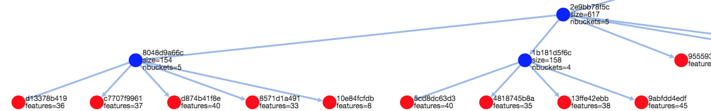

# GeoGig 1.2.1 Release Notes

November 23, 2018

`1.2.1` is a maintenance release. It backports some fixes and improvements for managing GeoGig repositories in a PostgreSQL database. Hence you should only worry about an upgrade process if you have an existing GeoGig database in Postgres. On the contrary, if you're creating a new geogig database, there's nothing extra to do, GeoGig will create the correct database schema for you.

### ls-repos

ls-repos shows repository names at a given base URI (i.e. directory or database). The verbose option can be used to generate CSV or a nice table with some extra information like number of branches, commits, feature types, and features per repository.

```
$ export repo="postgresql://localhost:5435/missouri?user=postgres&password=..."
$ geogig ls-repos --help
Usage: geogig ls-repos [options] <base URI> The URI without a repository name. (e.g. geogig ls-repos postgresql://localhost:5432/geogig_db?user=...&password=...)
  Options:
    -c, --csv
       If verbose output, use comma separated list instead of table output
       Default: false
    -v, --verbose
       verbose output
       Default: false
 $ geogig ls-repos $repo
groldan:missouri
volaya:missouri
 $ 
 $ geogig ls-repos -v $repo
╔══════════════════╤══════════╤═══════════════╤════════════════╤═══════════════╤════════════════╗
║ Name             │ Branches │ Total commits │ Unique commits │ Feature types │ Total features ║
╠══════════════════╪══════════╪═══════════════╪════════════════╪═══════════════╪════════════════╣
║ groldan:missouri │ 4        │ 125           │ 65             │ 5             │ 76,354,104     ║
║ volaya:missouri  │ 4        │ 122           │ 62             │ 5             │ 74,704,638     ║
╚══════════════════╧══════════╧═══════════════╧════════════════╧═══════════════╧════════════════╝

 $ geogig ls-repos -v --csv $repo
Name,Branches,Total commits,Unique commits,Feature types,Total features
groldan:missouri,4,125,65,5,76354104
volaya:missouri,4,122,62,5,74704638
 $ 
```

### postgres-ddl

`postgres-ddl` is an utility to generate the DDL script to initialize
a PostgreSQL database to be used by Geogig. Most of the time Geogig
does it all by itself when first accessing the database, but it could be
the case where the database user used to connect with has no enough
proviledges and the script needs to be run by hand using psql for
example.

### postgres-upgrade    

`postgres-upgrade` is an utility to upgrade an existing geogig database
from any geogig version prior to `1.2.1`. It will create a `geogig_metadata`
table and add a column to `geogig_graph_edge` in that is used to ensure the
correct order of commit parents in a commit graph traversal. Curiously,
in Postgres 9.4 it worked by accident, but Postgres 9.5+ returns the
parents in different order unless the query instructs it how to, which
is ok and exposed a bug in geogig itself.

If the PostgreSQL version is `10.0` or higher, and you're creating a new GeoGig 
database, the DDL script that GeoGig runs to initialize it will now create `HASH`
 indexes for the `geogig_object_*` tables, where the revision objects (commits, 
 tags, features, etc) are stored. This is because just since version 10.0, PostgreSQL 
 HASH indexes are WAL safe, and they result in slightly better performance under 
 load/with big datasets.

In order to fix an important bug, one of the geogig tables got a new column. For instance, 
`geogig_graph_edge` has a new `dstindex INT NOT NULL` column, which is used to
ensure the parent commit ids of any given merge commit are returned in the correct 
order when performing a commit graph traversal. For this reason, a new command has 
being added to GeoGig's command line interface to aid in the upgrade process, both in 
order to run the required DDL script, and to re-build the commit graph for all the repositories 
in the database in one shot.

```
$ geogig postgres-upgrade "postgresql://<server>[:port]/<database>?user=<dbuser>&password=<dbpassword>"
```

Here is an example output of running `postgres-upgrade`:

```
$ geogig postgres-upgrade "postgresql://localhost:5432/geogig_repositories?user=geogig&password=..."

Running DDL script:

-- SCRIPT START --
CREATE TABLE public.geogig_medatada (key TEXT PRIMARY KEY, value TEXT, description TEXT);
INSERT INTO public.geogig_medatada (key, value) VALUES ('geogig.version', '1.2.1');
INSERT INTO public.geogig_medatada (key, value) VALUES ('geogig.commit-id', 'f34c8dfc07454b7fd2fa339a7ae36ebdd5f97159');
INSERT INTO public.geogig_medatada (key, value) VALUES ('schema.version', '1');
INSERT INTO public.geogig_medatada (key, value) VALUES ('schema.features.partitions', '16');
TRUNCATE public.geogig_graph_edge;
ALTER TABLE public.geogig_graph_edge ADD COLUMN dstindex INT NOT NULL;
-- SCRIPT END --
       
Upgrading commit graph for all 17 repositories...
Upgrading graph for repository reg_2016_wgs84_g_83ee687a
Finished upgrading the geogig database to the latest version.
```

This will connect to the database and run the necessary DDL sentences, as well as rebuild the commit graph of all the repositories, which is not something that can be done purely in SQL, and would be the same than running `geogig rebuild-graph` for each of the repositories in the database.

Finally, if the database is up to date with the latest geogig postgres schema, a message saying so will be displayed:

```
$ geogig postgres-upgrade "postgresql://localhost:5432/geogig_repositories?user=geogig&password=..."

Database schema is up to date, checking for non DDL related upgrade actions...

Nothing to upgrade. Database schema is up to date
```
---

# GeoGig 1.2.0 Release Notes

October 20, 2017.
## The GeoGig team is pleased to announce the release of GeoGig 1.2.0!
This release has three major changes:

- Support for GeoServer 2.12 (WebAPI Refresh)
- Improved performance for Replication - Clone/Fetch/Pull/Push
- Numerous usability improvements to support the GeoGig-QGIS plugin

## Support for GeoServer 2.12 (web API Refresh)

One of the big changes in GeoServer 2.12 was to replace Restlet with Spring MVC. This necessitated GeoGig to also replace Restlet with Spring MVC. We made the new web API exactly equivalent to the old web API, so all the requests and responses are exactly the same - web client applications should not need any changes. We also made some improvements to the API documentation - see http://geogig.org/docs/interaction/web-api.html.

GeoServer 2.12 offers lots of new features and improvements: http://blog.geoserver.org/2017/10/17/geoserver-2-12-0-released/

NOTE:
For GeoServer 2.12 and newer, you must use GeoGig version 1.2.0 or newer (scroll down to the Downloads section).
For GeoServer 2.11 and older, you must use GeoGig version 1.1.1.

The GeoGig [releases page](https://github.com/locationtech/geogig/releases) contains the GeoServer plugin bundles with the appropriate versions of GeoGig.

## Improved performance for Replication - Clone/Fetch/Pull

The last few releases focused on performance related to rendering/querying data inside GeoGig. For this release, we have concentrated on improving how changes are shared among people (replication) in support of collaborative editing workflows.. This means that Clone/Fetch/Pull/Push operations are noticeably faster - sometime several orders of magnitude faster!
Numerous usability improvements to support the GeoGig-QGIS plugin

This release supports the upcoming GeoGig-QGIS plugin, which gives a powerful and user-friendly GUI front end to GeoGig. We've made some improvements - bug fixes and performance increases - to make this plugin as useable as possible. The GeoGig-QGIS plugin will be released on Boundless Connect (https://connect.boundlessgeo.com/) early 2018.

---

# GeoGig 1.1.1 Release Notes

July 10, 2017.

This release sits on top of 1.1.0, adding even more performance and robustness improvements.

Download bundles are available [here](https://github.com/locationtech/geogig/releases/tag/v1.1.1)

## Performance

We’ve, again, improved communication between Geoserver/GeoGig and PostgreSQL - and that means it’s 
FAST and requires 25% less network bandwidth.  This means lower infrastructure requirements
and quicker responses. 

NOTE: this requires an updated PostgreSQL driver; check the [installation instructions](http://geogig.org/docs/start/installation.html#postgresql-jdbc-driver-version).

Also, for this release we've started a performance assessment and improvement plan for geogig to geogig remoting (that is, cloning and synchronizing),
and introduced the first round of improvements for cloning from an HTTP remote to a local repository, with time savings of up to an order of magnitude!

There are still some rough edges specially when synchronizing a large number of commits that we'll be working on for the 1.2 series.

## Caching

GeoGig 1.1.1 has a simplified and improved cache, offering;

* Very simple configuration - simply set the size of the cache with one number.
* Sharing - one cache is now shared among all your repos, allowing more heavily used repos more efficient access to the cache.
* Statistics - the cache’s effectiveness can now be explored, allowing administrators better information to make configuration decisions. 
* Independence - the cache can be configured on a per-instance basis, allowing each instance to be individually tuned. 

Please see the [Shared cache](http://geogig.org/docs/start/runtime.html#shared-internal-cache) documentation and how to
configure it on the [GeoServer GUI](http://geogig.org/docs/interaction/geoserver_ui.html#geogig-runtime-settings).


## Clustering

The GeoGig team have extensively tested the GeoGig GeoServer plugin in a clustered environment and we're more than glad with the results.
Please see the [upgrade guide](http://geogig.org/upgrade/Upgrade_1.1_to_1.1.1.html).


## Bug Fixes

We performed more testing this release and found (and fixed) several minor problems. We also addressed a few issues reported on the mailing list.

* Fix Rocksdb backend's durability issues. A rocksdb backed repository was corrupted if edited through the web API once the server was shut down.
* Avoid stack trace when trying to unalias a CLI command that doesn't exist.
* Avoid failure to return the pg config db if the repository does not exist.
* Fix error when cloning on Windows
* Fix an issue which prevents cloning into postgres from http.
* Fix empty string bug in custom geotools converter factories.It had the side effect of breaking the geoserver config UI
for ImageMosaic layers as it uses the Converters framework to parse the "Bands" argument to an int[] that comes as an empty string.
* Upgrade downloadable postgres DDL script to include index tables
* Make sure PG connection pools are unique for a set of connection parameters add better formatting for documentation

GeoGig 1.1.0 Release Notes
==============================

May 10, 2017.

GeoGig 1.1 is now out for general consumption!

Stakeholders asked us to make GeoGig faster - and 1.1 is all about making things faster! Most importantly, we’ve added
the Spatial-Index-With-Attributes and greatly improved the networking, caching, and rendering performance.  We expect
that all users will see substantial performance improvements.

For existing GeoGig installations, see our detailed [Upgrade Guide](http://geogig.org/upgrade/index.html)
(which includes helpful tips for installations).

Download bundles are available [here](https://github.com/locationtech/geogig/releases/tag/v1.1.0)

### Release Overview:

This release introduces the long awaited spatial indexing capabilities to GeoGig.

GeoGig's spatial index can index the whole history of a repository's datasets. It was
developed from scratch to take advantage of geogig's core design principle to efficiently
store large amounts of features and quickly compute the differences between any two
snapshots, the Merkle Tree (a.k.a. Hash Tree), that allows us to create a DAG (Directed
Acyclic Graph) where each data snapshot is an entry point to the graph, while they share
all but what changes internally.

To the best of our knowledge, this is the first spatial index that can effectively
work on such a graph of data.

When an index is created for a feature tree (i.e. layer), a new tree is created mirroring
the canonical tree contents, but using a quad-tree clustering strategy for its non terminal
nodes.

#### Spatial indexing capabilities:

* Indexes are automatically updated on commits. Create an index for a layer, and any operation
that creates a new commit will trigger the update of the index (i.e. commit, rebase, merge, etc).

* Materialized attributes: the spatial index can materialize any spatial or non spatial attribute
of the FeatureType being indexed, in order to speed up attribute queries as well as spatial ones.
For example, you might want to include the attributes needed by the Styled Layer Descriptor to properly
filter out Features for rendering on a WMS; or include the time/elevation attributes to speed up
queries on time series in GeoServer. 

* Spatial indexing command set: the geogig command line and its web API include a full set of
commands to manage the indexes. Run `geogig index --help` or browse the online documentation at
http://geogig.org/docs for more information.


#### Other improvements in this release:

* Better support for foreign CRS definitions. Importing from datasets that define its coordinate
reference system in non OGC WKT formats (e.g. most shapefiles) are now correctly matches to their
corresponding CRS from the EPSG database, providing extra CRS metadata such as area of validity.
* Better PostgreSQL backend caching. The PostgreSQL backend's internal cache uses an improved
serialization format that's a lot faster to decode, while still allowing to control the cache
size by storing serialized objects instead of Java objects.
* Performance improvements to internal threading.
* Fix a bug in updating quad-trees.
* Fix a bug when retrieving repository logs for very old ancestors with large numbers of commits.
* Enable and fix bugs around the ability to cancel many GeoGig operations.
* Fix a bug in export-diff where incorrect commit IDs were sometimes being used.
* Add and enhance concurrency testing.


#### The Spatial-Index-With-Attributes Index

<p align="center">
  
  <i>Visualization of a Spatial-Index-With-Attributes Index</i>
</p>

The new GeoGig index (a revision-sharing QuadTree index) greatly improves performance for the two most common types of queries - spatial queries and attribute queries.

For spatial searches, the QuadTree organization of the index makes for efficient retrieval of features.

The most common types of attribute query (“only display Highway and Freeways”, “only display data marked between these two dates” ) is also optimized by storing Extra Attributes inside the QuadTree.  When executing the query, GeoGig can use the extra information in the index to quickly filter out unneeded features.

The end result is **much** faster query performance (and much less network traffic).

---

GeoGig 1.0.0 Release Notes
==========================

December 21, 2016.

The GeoGig team is proud to announce the graduation of Release Candidate 1.0-RC4 to 1.0!
Only one minor bug was found in RC4 (related to deriving its version) that needed to be 
fixed for the 1.0 release. Please see the Release Notes for RC4 below for more.

GeoGig 1.0-RC4 Release Notes
============================

December 19, 2016.

These are the release notes for the fourth GeoGig release candidate.

Five important things happended since 1.0-RC3 besides several bug fixes:

* First and foremost, the developer's team got three new memebers. Join us
to congratulate (and thank!) David Blasby, Morgan Thompson, and Alex Goudine
for becoming geogig committers and help us drive this project further and farther.

* We have cleared out all of our Intellectual Property checks on all our
dependencies and have now [LocationTech](https://locationtech.org/) blessing to perform
a sponsored release!
Thanks to LocationTech, Eclipse Foundation's geospatial branch, for their
continued support and commitment to the success of this and the other projects
under its umbrella.

* The new RevTreeBuilder infrastructure became mainstream. It replaces the
legacy tree builder in order to generate revision trees faster, create no
garbage in the objects database (the old one left dangling tree objects
increasing the database size unnecessarily), and perhaps more importantly,
enables the use of the same infrastructure to build spatial and attribute
indexes on revision graphs (yes, you'll be able to index all your data 
history, stay tunned).

* The PosgreSQL storage backend is now WAL and replication safe, by moving
to use B-Tree indexes instead of Hash indexes. Thanks David Blasby for the
thorough performance testing. 

* The default storage backend for local repositories now uses [Rocksdb](http://rocksdb.org/).
It's faster than the old BerkeleyDB Java Edition database, and produces
smaller databases on disk.
The BerkeleyDB storage backend was taken off the official build, but Boundless
still provides a separate plugin download, so if you have existing repositories
just download [the bdbje plugin](https://github.com/locationtech/geogig/releases/download/v1.0-RC4/geogig-plugins-bdbje-1.0-RC4.zip) and unzip it
under your `<geogig installation directory>/lib/` folder.

We are really really close to a first 1.0 official release now! Maybe even for Christmas!

Other important bug fixes and improvements:
-------------------------------------------

- Fix deadlock due to diff traversal not being closed
- Make sure merge aborts cleanly
- Replace WriteBack by the more efficient UpdateTree
- Add license information to documentation
- Add functional tests for web api commands.
- Fix windows handling of ANSI escapes 
- Fix Incompatible Feature Type error for equivalent CRSs
- Make geopackage fid mappings memory safe by using a rocksdb-backed map
- Fix parsing of PostgreSQL URIs 
- Update documentation for api module
- Increase unit test coverage of API Module
- Improve handling of incorrect parameters in geotools export commands
- Fix cloning from absolute paths
- Add NOTICE file with dependencies 
- Make the new RevTreeBuilder the default
- Add functional tests for http synchronization endpoints
- Serialization version 2.1 
- Add Eclipse CBI signing support to main pom.xml
- move to using BTREE instead of HASH index for postgresql backend 
- Fix missing feature mappings from GeoPackage import response


GeoGig 1.0-RC3 Release Notes
============================

August 4, 2016.

These are the release notes for the third GeoGig release candidate.

We have worked hard since RC2 on fixing the last outstanding bugs that prevented 
a solid release, and focused on some performance improvements.

This release is also the official launch of the PostgreSQL storage backend [1],
which allows to store several repositories in a single postgres database.

Also, the GeoServer plugin is being released for GeoServer 2.8, 2.9, and 2.10 series,
with several improvements both on GUI [2] and REST [3] configuration.

[1] <http://geogig.org/docs/repo/storage.html>
[2] <http://geogig.org/docs/interaction/geoserver_ui.html>
[3] <http://geogig.org/docs/interaction/geoserver_web-api.html>

The next steps are a strong focus on performance and scalability and a final
1.0 release by the end of the year. Stay tuned and write us back with your 
feedback about this important milestone.

The GeoGig team.-

Important features
------------------

- PostgresSQL storage backend
- GeoServer 2.8, 2.9, and 2.10 plugin
- GeoServer support for PostgreSQL repositories
- Several GeoServer GUI and REST improvements and user docs

Improvements
------------
- Update Postgres backend to use a serial integer as repository primary key 
- Move core API to a new geogig-api module 
- Allow amend to only update commit message. 
- Dramatic improvement for mergeop when merging features. 


Most Important Bug fixes
------------------------

- IMPORTANT BUG EXPOSED: leaf RevTree node storage order is wrong
- Geometry automerge is dangerous and produces invalid geometries
- Unwanted geometry changes on re-import of polygon layers bug enhancement
- Immutability of RevFeature compromised
- Enforce normalization of Polygon geometries
- Update Diff traversals to close properly when terminated early
- `reset --hard` and `merge --abort` leave dangling blobs
- `add` command deletes all conflicts
- GeoGigFeatureStore removes feature tree if instructed to delete all features in a layer

