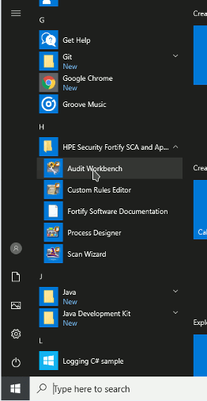
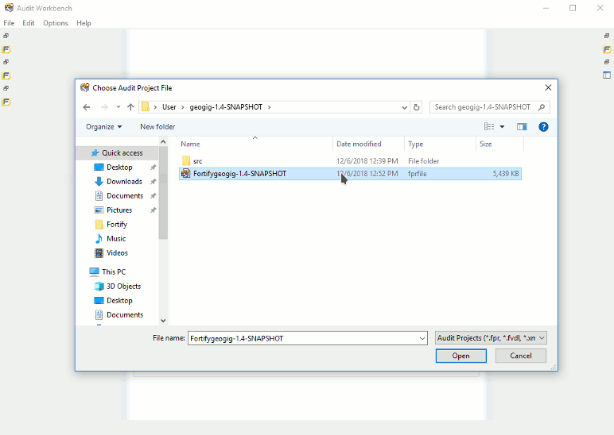
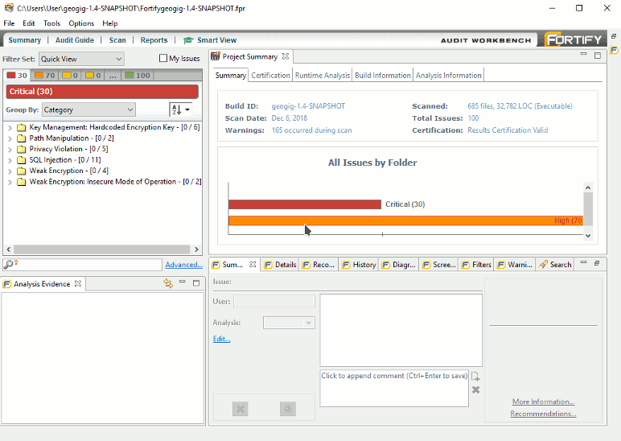

# Running Fortify Security Scans

[Fortify](https://www.microfocus.com/en-us/products/static-code-analysis-sast/overview) is static source code analyzer that reports possible security vulnerabilities in source code and prioritizes them by severity and importance, pinpoints the root cause with line of code detail, and provides best practices to help remove exploitable vulnerabilities that pose the greatest threats.

At the time of writing (December 2018), we're using Fortify Static Code Analyzer 17.20.0183 (using JRE 1.8.0_144) on Windows 10.


##Resouces:

-  [Fortify 17.20 user manuals](https://www.microfocus.com/documentation/fortify-static-code-analyzer-and-tools/1720/) 
-  [Fortify 18.20 user manuals](https://www.microfocus.com/documentation/fortify-static-code-analyzer-and-tools/1820/) 

## Pre requisites

On a Windows machine:

- Install Java JDK 1.8
- Install Maven 3.6.0
- Configure environment variables : `JAVA_HOME=<jdk installation directory>`, `MAVEN_HOME=<maven installation directory>`, and `PATH=%PATH%:%JAVA_HOME%\bin:%MAVEN_HOME%\bin`
- Install Git
- Install Fortify Static Code Analyzer 17.20.0183
- Install the Foritify sca-maven-plugin:

```
PS C:\Users\User>
PS C:\Users\User> Expand-Archive "C:\Program Files\HPE_Security\Fortify_SCA_and_Apps_17.20\plugins\maven\maven-plugin-bin.zip" fortify_maven_plugin
PS C:\Users\User> cd .\fortify_maven_plugin\
PS C:\Users\User> cd .\install.bat
```

That will install the maven plugin in the local maven repository at `%HOME%\.m2\repository\com\hpe\security\fortify\maven\plugin\sca-maven-plugin\17.20\sca-maven-plugin-17.20.jar`

# Quick start

Start by cloning the geogig source code if needed:
```
PS C:\Users\User> git clone "https://github.com/locationtech/geogig.git"
PS C:\Users\User> cd geogig\src
PS C:\Users\User\geogig\src> 
```

We've configured the `sca-maven-plugin` to run Fortify scans through maven.

Fortify doesn't understand Lombok annotations, so we've got a maven profile to generate a "delombok'ed" code base using the `delombok` profile:

```
PS C:\Users\User\geogig\src> mvn clean install -DskipTests -Pdelombok
```

That creates a separate source tree under `<geogig>/build/fortify/geogig-<version>` that has all the lombok annotations removed and the bytecode lombok would create at compile time is instead injected directly as source code to the .java files.

Now use the `fortify` profile on the delomboked source code base to run the scan:

```
PS C:\Users\User\geogig\src> cd ..\build\fortify\geogig-1.4-SNAPSHOT\src
PS C:\Users\User\geogig\build\fortify\geogig-1.4-SNAPSHOT\src> mvn clean integration-test -Pfortify
```

It'll take a number of minutes for Fortify to run the clean, translate, and scan goals. Once finished, the results will be in the `target\fortify` directory:

```
PS C:\Users\Developer\git\geogig\build\fortify\geogig-1.4-SNAPSHOT\src> dir .\target\fortify\


    Directory: C:\Users\Developer\git\geogig\build\fortify\geogig-1.4-SNAPSHOT\src\target\fortify


Mode                LastWriteTime         Length Name
----                -------------         ------ ----
-a----       12/12/2018   9:52 AM        4904335 geogig-1.4-SNAPSHOT.fpr
-a----       12/12/2018   9:39 AM            163 sca-clean-geogig.txt
-a----       12/12/2018   9:39 AM            546 sca-clean.log
-a----       12/12/2018   9:42 AM            403 sca-scan-geogig.txt
-a----       12/12/2018   9:52 AM          13684 sca-scan.log
-a----       12/12/2018   9:39 AM            456 sca-translate-geogig-main.txt
-a----       12/12/2018   9:39 AM            353 sca-translate-geogig-pom.txt
-a----       12/12/2018   9:42 AM         188299 sca-translate.log
```

The `.fpr` file is the project file to be open with Fortify's **Audit Workbench** application.
The `sca-translate.log` file needs to be scanned for `SEVERE` log messages. They most often indicate a Java call that Fortify can't understand. All those errors need to be fixed for Fortify to be able of scanning the whole codebase and not produce cascaded errors.


---

That's it for the quick start guide. Follow on with the detailed process section bellow for more information.

---

# Detailed process 

## Prepare codebase for analysis

### Delombok

Our codebase makes use of Project Lombok[Project Lombok](https://projectlombok.org/features/delombok) 1.18.2 to reduce Java boilerplate code.

Lombok uses java annotations to add java code at compile time. For example, in the following code:

```
import lombok.Value;
public @Value class Point2D{
	private final double x;
	private final double y;
}
```

the `@Value` annotation generates required Java code for instances of that class to be an immutable value object with standard property accessors, effectively becoming something like

```
public class Point2D{
 	private final double x;
	private final double y;
	
	public @Generated Point2D(double x, double y){
		this.x = x;
		this.y = y;
	}
	public @Generated @Override String toString(){...}
	public @Generated @Override boolean equals(Object o){...}
	public @Generated @Override int hashCode(){...}
	public double getX(){return x;}
	public double getY(){return y;}
}
```

Being a compile time preprocessor, what it generates is not available in the source code files but in the compiled bytecode.

Fortify is a static _code_ analyzer and cannot interpret Lombok annotations. This leads to Fortify scans on any Lombok annotated class, or any client class of an annotated class, to be unparseable by Lombok and hence not scanned for security issues. 

Fortunately, Lombok comes with a [delombok](https://projectlombok.org/features/delombok) utility that creates a separate, pre-processed set of source code files with annotations removed and the source code that it adds at compile time written directly to the source code.

`Delombok` can be run from the command line, or as a maven goal using the `lombok-maven-plugin`.

We've set up a maven profile that will use the plugin to generate a separate source code tree with the "delomboked" source files.

The basic configuration for the plugin is as follows:
```
<build>
  <plugins>
    <plugin>
      <groupId>org.projectlombok</groupId>
      <artifactId>lombok-maven-plugin</artifactId>
      <version>1.18.4.0</version>
      <executions>
        <execution>
          <phase>generate-sources</phase>
          <goals>
            <goal>delombok</goal>
          </goals>
        </execution>
      </executions>
    </plugin>
  </plugins>
</build>
```

That would put the delomboked files under each module's `src/target/generated-sources` directory.

We've created a more complicated set up to that the whole source tree is replicated to a separate directory (`build/fortify/geogig-<version>`). See the "Profile set up section" before for more information.

### Configure the fortify maven plugin

In order to run the fortify scans using maven, all that's needed is to set up the `sca-maven-plugin` in the root pom as follows, and then run `mvn integration-test`:

```
      <build>
        <plugins>
          <plugin>
            <groupId>com.hpe.security.fortify.maven.plugin</groupId>
            <artifactId>sca-maven-plugin</artifactId>
            <version>17.20</version>
            <executions>
              <execution>
                <goals>
                  <goal>clean</goal>
                  <goal>translate</goal>
                  <goal>scan</goal>
                </goals>
              </execution>
            </executions>
          </plugin>
        </plugins>
      </build>
```

Since we run the scans out of the delomboked source tree, we've added this plugin to the `pom.xml` that will be the root of the delomboked code. See the next section for the whole profile set up information.

### Profile set up

In summary, what the profile does is:

- Every module's pom.xml sets the property `project.relativePath` to be the relative path from the root pom directory, since we didn't find an easy way for maven to automatically resolve it. For example, the core module sets `<properties><project.relativePath>core</project.relativePath></properties>`, and the `storage/postgres` module `<properties><project.relativePath>storage/postgres</project.relativePath></properties>`.
- Uses the `maven-resources-plugin` to copy each module's pom.xml and resource files to its delomboked mirror directory
- Uses the `lombok-maven-plugin` to generate the delomboked .java files mirroring each module's source tree at the target destination (e.g. `src/core` is delomboked to `build/fortify/geogig-<version>/src/core`)
- The delomboked root pom is a different one than the original root pom. It's copied from `build/fortify/pom.xml` to `build/fortify/geogig-<version>/src/pom.xml`, and contains the `sca-maven-plugin` configuration and only the modules that are to be scanned.


To check how it's done look at the `delombok` profile in the project's [root pom.xml](../../src/pom.xml).

## Run the scan and resolve errors

We've added the `sca-maven-plugin` to a `fortify` maven profile on the delomboked source code base's root pom. So run:

```
PS C:\Users\User> cd <geogig>/buld/fortify/geogig-<version>/src
PS C:\Users\User> mvn clean integration-test -Pfortify
```

You'll see sections like the following for each project module as the `sca-maven-plugin` runs the `clean`, `translate`, and `scan` goals:

```
[INFO] --- sca-maven-plugin:17.20:clean (default) @ geogig-core ---
[INFO] Aggregate: true
[INFO] Index of Project: 3/13
[INFO] Packaging Type: jar
[INFO] Base Dir: C:\Users\Developer\git\geogig\build\fortify\geogig-1.4-SNAPSHOT\src\core
[INFO] POM: C:\Users\Developer\git\geogig\build\fortify\geogig-1.4-SNAPSHOT\src\core\pom.xml
[INFO] Skipping to clean in aggregate mode
[INFO]
[INFO] --- maven-jar-plugin:3.0.2:jar (default-jar) @ geogig-core ---
...
[INFO] --- sca-maven-plugin:17.20:translate (default) @ geogig-core ---
[INFO] Aggregate: true
[INFO] Index of Project: 3/13
[INFO] Packaging Type: jar
[INFO] Base Dir: C:\Users\Developer\git\geogig\build\fortify\geogig-1.4-SNAPSHOT\src\core
[INFO] POM: C:\Users\Developer\git\geogig\build\fortify\geogig-1.4-SNAPSHOT\src\core\pom.xml
[INFO] Fail on Error: false
[INFO] Translating pom.xml...
[INFO] Build ID: geogig-1.4-SNAPSHOT
[INFO] Executing Command: cmd.exe /X /C "sourceanalyzer @C:/Users/Developer/git/geogig/build/fortify/geogig-1.4-SNAPSHOT/src/core/target/fortify/sca-translate-geogig-core-pom.txt"

Fortify Static Code Analyzer 17.20.0183 (using JRE 1.8.0_144)
[INFO] Source File Path: C:\Users\Developer\git\geogig\build\fortify\geogig-1.4-SNAPSHOT\src\core\src\main\java
[INFO] Resources: C:\Users\Developer\git\geogig\build\fortify\geogig-1.4-SNAPSHOT\src\core\src\main\resources
[INFO] Translating main...
[INFO] Build ID: geogig-1.4-SNAPSHOT
[INFO] Source: 1.8
[INFO] Executing Command: cmd.exe /X /C "sourceanalyzer @C:/Users/Developer/git/geogig/build/fortify/geogig-1.4-SNAPSHOT/src/core/target/fortify/sca-translate-geogig-core-main.txt"
Fortify Static Code Analyzer 17.20.0183 (using JRE 1.8.0_144)
[INFO]
[INFO] --- sca-maven-plugin:17.20:scan (default) @ geogig-core ---
[INFO] Aggregate: true
[INFO] Index of Project: 3/13
[INFO] Packaging Type: jar
[INFO] Base Dir: C:\Users\Developer\git\geogig\build\fortify\geogig-1.4-SNAPSHOT\src\core
[INFO] POM: C:\Users\Developer\git\geogig\build\fortify\geogig-1.4-SNAPSHOT\src\core\pom.xml
[INFO] Skipping to scan in aggregate mode
[INFO]
```

Once the build finishes, the following log files will be available at the root's `target/fortify` folder:

```
$ ls -l target/fortify/
total 4989
-rw-r--r-- 1 Developer 197121 4891410 Dec 12 04:54 geogig-1.4-SNAPSHOT.fpr
-rw-r--r-- 1 Developer 197121     539 Dec 12 04:41 sca-clean.log
-rw-r--r-- 1 Developer 197121     156 Dec 12 04:41 sca-clean-geogig.txt
-rw-r--r-- 1 Developer 197121   14232 Dec 12 04:54 sca-scan.log
-rw-r--r-- 1 Developer 197121     389 Dec 12 04:44 sca-scan-geogig.txt
-rw-r--r-- 1 Developer 197121  188783 Dec 12 04:44 sca-translate.log
-rw-r--r-- 1 Developer 197121     435 Dec 12 04:41 sca-translate-geogig-main.txt
-rw-r--r-- 1 Developer 197121     332 Dec 12 04:41 sca-translate-geogig-pom.txt
```

The `.fpr` file is the Fortify project file you can open in the "Audit Workbench" Fortify application.

Take a look at `sca-translate.log`. Most probably, Fortify will log several translation errors as it can't understand some Java constructs or method calls. Look for `SEVERE` log messages, they will mostly be of the type `Unable ro resolve function ....`.

You need to resolve all of those because that means all those files and all its callers weren't analyzed, leading a lot of false positives and warnings when opening the `.fpr` in Audit Workbench.

Our first run resulted in 41 log entries like the following:

```
$ grep "Unable to resolve function" sca-translate.log
Unable to resolve function 'com.google.common.collect.Lists.transform' at (C:\Users\Developer\git\geogig\build\fortify\geogig-1.4-SNAPSHOT\src\api\src\main\java\org\locationtech\geogig\model\RevObjects.java:355:15)
Unable to resolve function 'com.google.common.collect.Iterables.transform' at (C:\Users\Developer\git\geogig\build\fortify\geogig-1.4-SNAPSHOT\src\api\src\main\java\org\locationtech\geogig\storage\IndexDuplicator.java:160:39)
Unable to resolve function 'com.google.common.collect.Iterators.transform' at (C:\Users\Developer\git\geogig\build\fortify\geogig-1.4-SNAPSHOT\src\api\src\main\java\org\locationtech\geogig\storage\internal\ObjectStoreDiffObjectIterator.java:141:26)
Unable to resolve function 'com.google.common.collect.Iterables.transform' at (C:\Users\Developer\git\geogig\build\fortify\geogig-1.4-SNAPSHOT\src\core\src\main\java\org\locationtech\geogig\data\FindFeatureTypeTrees.java:88:54)
...
```

In our case, most of these errors were resolved by replacing calls to guava utility classes by plain Java 8 constructs, mostly using the Streams API. 

For example:
```
Lists.transform(commit.getParentIds(), RevObjects::toShortString);
```
was replaced by
```
commit.getParentIds().stream().map(RevObjects::toShortString).collect(Collectors.toList())
```

After resolving all the errors in `sca-translate.log`, run the scan and look for errors in `sca-scan.log`.

We've got only this one:
```
[2018-12-12 06:10:37.782 Thread-43 SEVERE 1202]
Unable to resolve symbol 'result' at (C:\Users\Developer\AppData\Local\Fortify\sca17.2\build\geogig-1.4-SNAPSHOT\model069FC7FC-8037-43C6-8C48-658C36E1582C-6690578593880907320.java:11:29)
```

Which mapped to the following warning several lines up in the log file:
```
Unresolved variable: result @ DiffSummaryOp.java:371
[2018-12-12 06:09:55.222 Thread-20 WARNING]
Unresolved variable: result @ DiffSummaryOp.java:372
[2018-12-12 06:09:55.222 Thread-20 WARNING]
Unresolved variable: result @ DiffSummaryOp.java:373
```

Finally, use the Audit Workbench to open the `.fpr` file as shown bellow:

 

 

 

 

