.. _geoserver_ui:

GeoServer GUI configuration
###########################

A GeoServer extension is available to allow GeoServer to interact with GeoGig repositories and use them as datastores. It enables a GeoGig repository to be exposed as a remote for cloning, pushing, and pulling, as well as to publish its data via OGC services (WMS/WFS/WMTS/etc). Each top-level tree (often called "feature tree") in a GeoGig repository corresponds to a GeoServer layer. GeoServer treats a GeoGig repository configured as a store in much the same way as it does a database.

Building/installing the GeoServer GeoGig extension
==================================================

You can download the latest stable version of the GeoGig GeoServer plugin from the `GeoGig <http://www.geogig.org/>`_ home page. There is a version of the plugin available for all supported versions of GeoServer.

In order to build it from sources, a GeoGig module is currently included in the 2.8.x and newer branches of GeoServer's community extensions. To build it, you will need to have Maven 3 and a Java JDK (version 8). First, clone the GeoServer GitHub repository.

::

    git clone git@github.com:geoserver/geoserver.git

Change into the ``geoserver`` directory:

::

    cd geoserver

Checkout the desired version branch branch (GeoServer 2.12.x for example):

::

    git checkout 2.12.x

Change into the ``src`` directory:

::

    cd src

Build the Community Modules:

::

    mvn clean install -DskipTests assembly:attached -f community/pom.xml -P communityRelease

This will build all of the GeoServer Community modules, including the plugin for GeoGig. Once the assembly completes, you should have a plugin bundle here:
::

    geoserver/src/community/target/release/geoserver-2.12-SNAPSHOT-geogig-plugin.zip

To install the GeoGig extension, unzip the above bundle into the GeoServer ``WEB-INF/lib`` folder of your GeoServer install and **restart** GeoServer.

::

    unzip geoserver/src/community/target/release/geoserver-2.12-SNAPSHOT-geogig-plugin.zip -d <GeoServer install dir>/webapps/geoserver/WEB-INF/lib/

    <restart GeoServer>

You should now be able to configure GeoGig repositories and use them as datastores.

Configuring a GeoGig store in GeoServer
=======================================

When GeoServer is built with GeoGig support, it will be available as a Store type in the GeoServer admin UI.

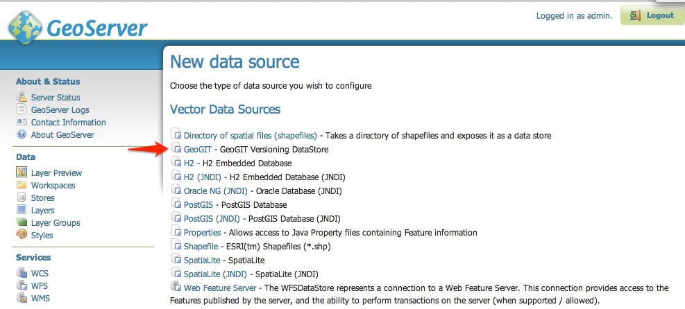

You can configure a store by:

.. _configure-datastore-create-new:

- Creating a brand new GeoGig repository (see :ref:`create-new-repo`):

.. _configure-datastore-import-existing:

- Importing an existing GeoGig repository that has not yet been configured within GeoServer (see :ref:`import-existing-repo`):

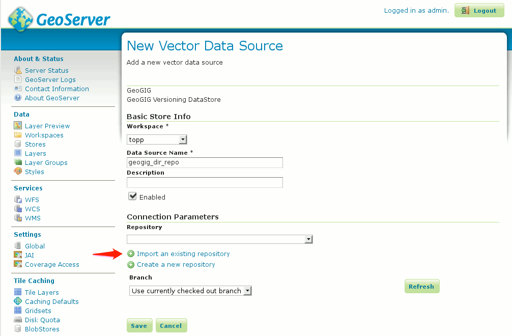

- Selecting an existing GeoGig repository that has been previously configured within GeoServer:

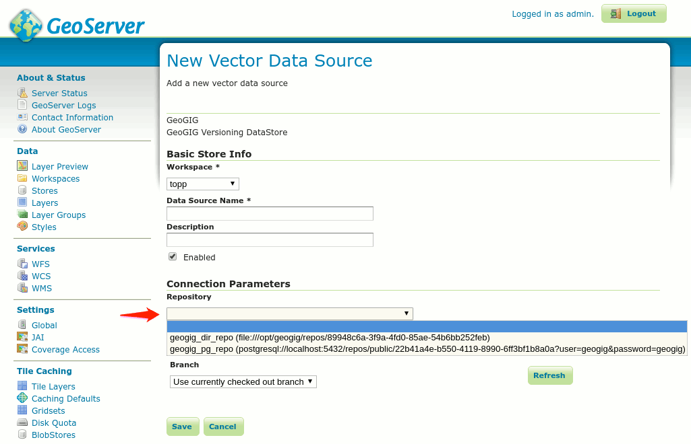

.. _automatic-indexing-geoserver-ui:

Advanced Options: Automatic Indexing
------------------------------------

When configuring a GeoGig datastore, you can also chose to have the plugin automatically create a spatial index in the underlying repository to improve GeoGig performance. Simply check the ``Automatically index Time and Elevation dimensions`` checkbox and save:

.. figure:: ../img/configure-geogig-auto-indexing.png

When this option is enabled on a GeoGig datastore, any time a Layer in the repository is added/edited, GeoGig will create a spatial index on the Geometry attribute of the Layer's feature type (or update the index if one already exists).
The index will also include any feature type attributes that are selected on the Dimensions tab of the Layer publishing page for Time and/or Elevation. This will help increase the performance of GeoGig for satisfying OGC requests that
involve those attributes (example: a GetCapabilities request that is going to return all unique Time dimension values for a given Layer).

You can read more about GeoGig repository indexes in the section :ref:`web-api-indexing-commands`.

Publishing Layers
-----------------

Regardless of the method used to create the datastore, you will need to publish each top-level tree as a layer, individually.

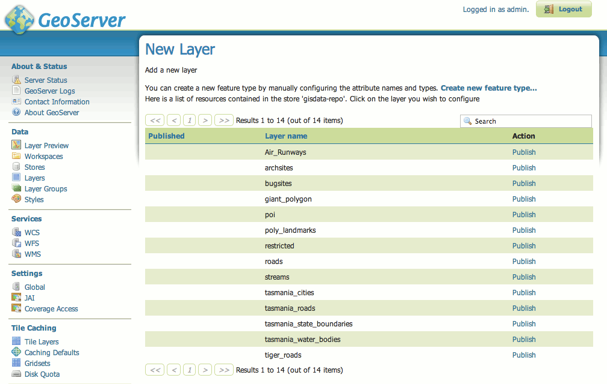

It may be necessary to specify the SRS for your data if it is not recognized by GeoServer.

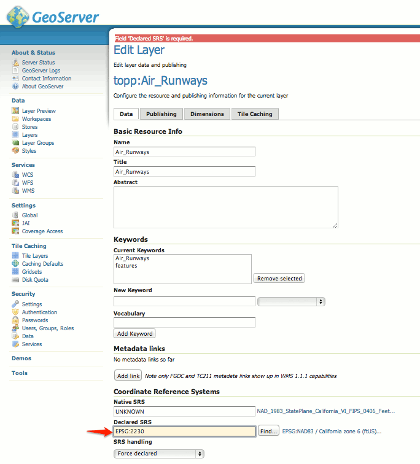

.. _create-new-repo:

Creating a new GeoGig repository in GeoServer
=============================================

You can create new GeoGig repositories through the :ref:`Create new GeoGig datastore <configure-datastore-create-new>` page or by navigating to the `GeoGig Repositories` configuration page in the admin bar.

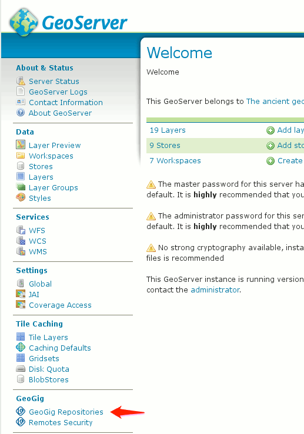

and selecting `Create new repository`

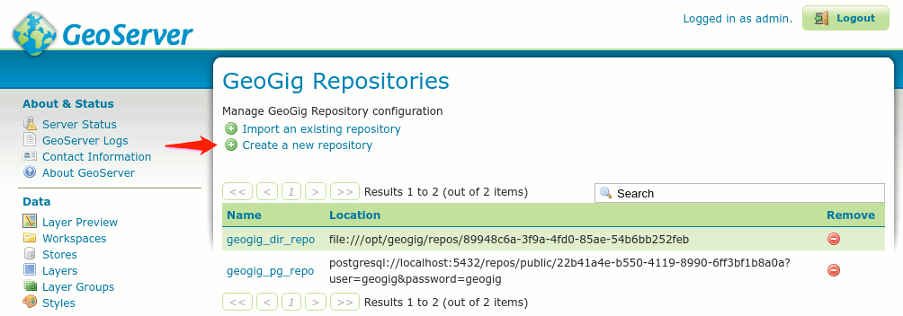

On the GeoGig repository configuration page, you can choose which type of repository you want, either a :ref:`directory-backed GeoGig repository <create-new-directory-repo>`, or a :ref:`PostgreSQL-backed GeoGig repository <create-new-postgres-repo>`. A directory-backed repository will store GeoGig data in a directory on the GeoServer filesystem, while a PostgreSQL-backed repository will store the GeoGig information in a PostgreSQL database. The database can be running on the same server as GeoServer or it can be remote.

.. _create-new-directory-repo:

Creating a new directory-backed GeoGig repository
=================================================

To create a new GeoGig repository that is backed by the filesystem, select **Directory** from the **Repository Type** pull-down, enter a **Repository Name**, a **Parent Directory** and click "Save":

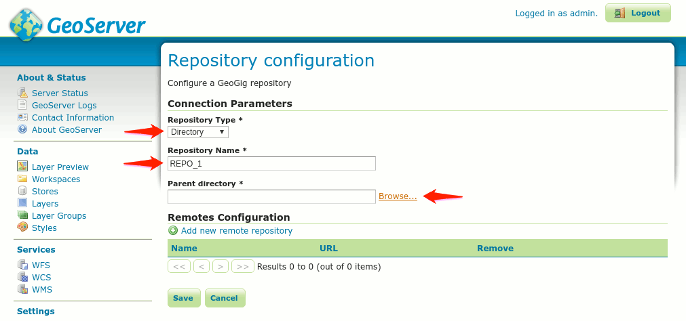

You can enter the parent directory manually or select one from a directory chooser dialog by clicking the **Browse...** link:

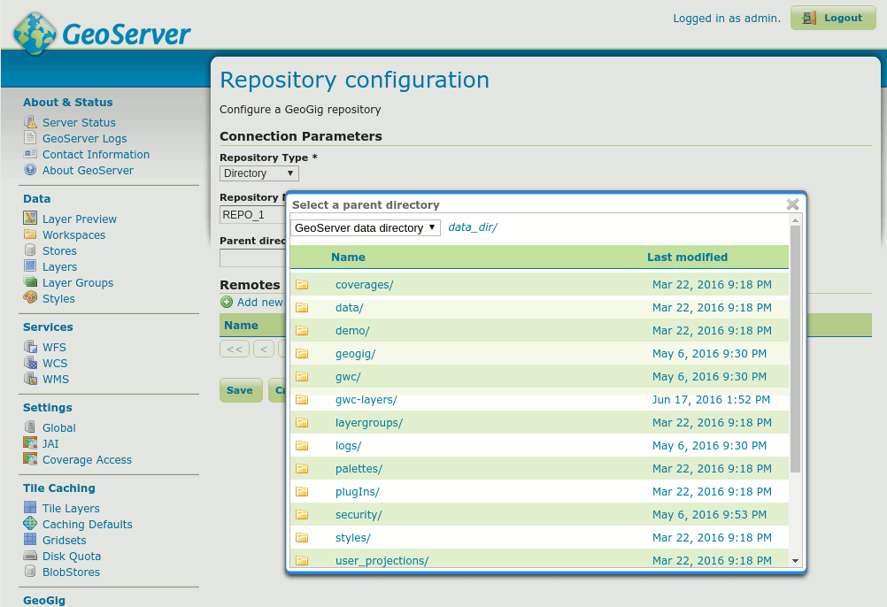

.. _create-new-postgres-repo:

Creating a new PostgreSQL-backed GeoGig repository
==================================================

To create a new GeoGig repository that is backed by a PostgreSQL database, select **PostgreSQL** from the **Repository Type** pull-down, enter the relevant database connection parameters and click "Save".

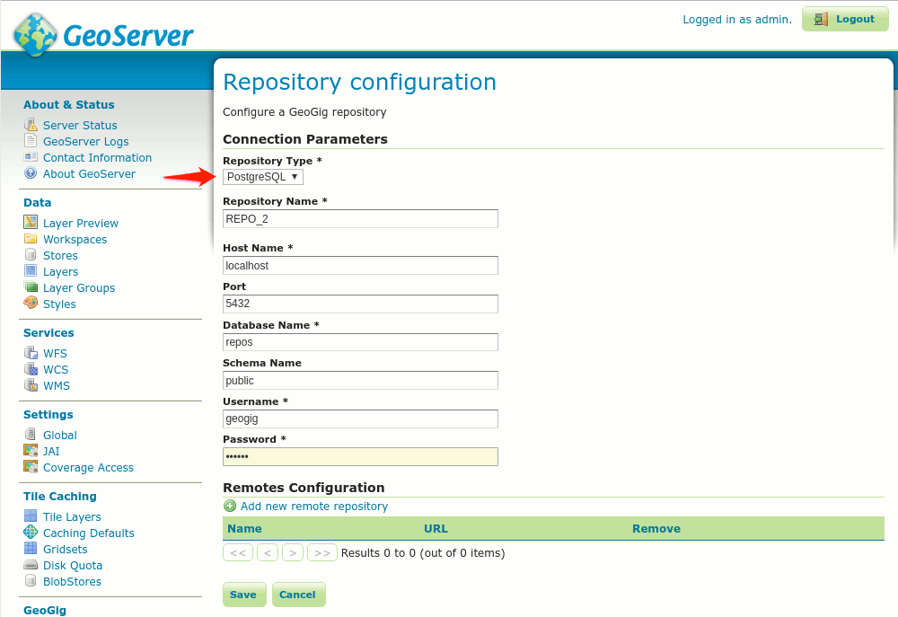

.. _import-existing-repo:

Importing an existing GeoGig repository in GeoServer
====================================================

You can create new GeoGig repositories through the :ref:`Create new GeoGig datastore <configure-datastore-import-existing>` page or by navigating to the `GeoGig Repositories` configuration page in the admin bar

and selecting `Import an existing repository`

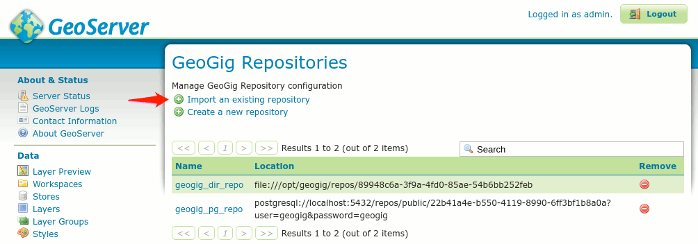

Just as when creating new repositories, you have the option to import existing Directory-backed repositories or PostgreSQL-backed repositories. Select the **Repository Type** and choose/enter the repository location details:

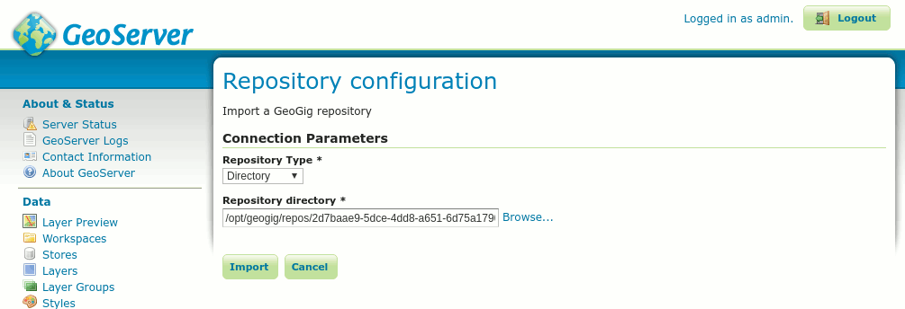

   *Directory-backed Repository configuration*

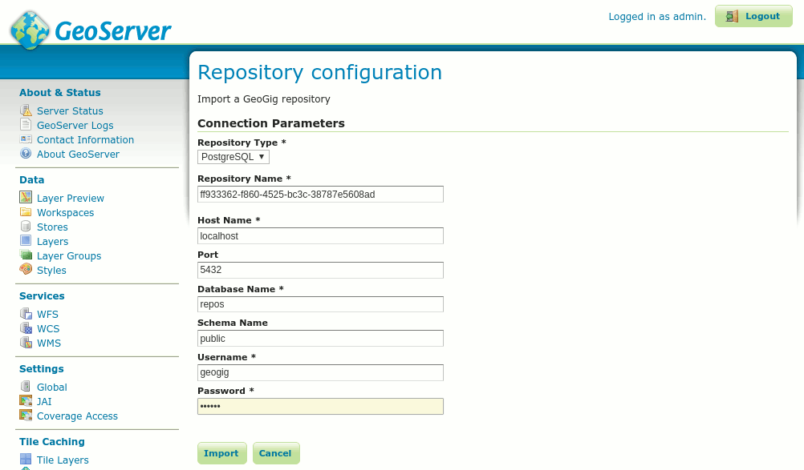

   *PostgreSQL-backed Repository configuration*
   
.. _configure-repo:
   
Configuring a GeoGig repository in GeoServer
============================================

You can set both global and local repository config settings through the repository configuration page.  This is accessed by navigating to the `GeoGig Repositories` configuration page in the admin bar.

From here, click on an existing repository to go to the configuration page.  Existing configuration settings will be listed in local and global tables.  Local settings are only applied to the repository that is being configured.  Global settings, however, apply to all repositories on the file system (in the case of a directory-backed repository) or the database (in the case of a PostgreSQL-backed repository).

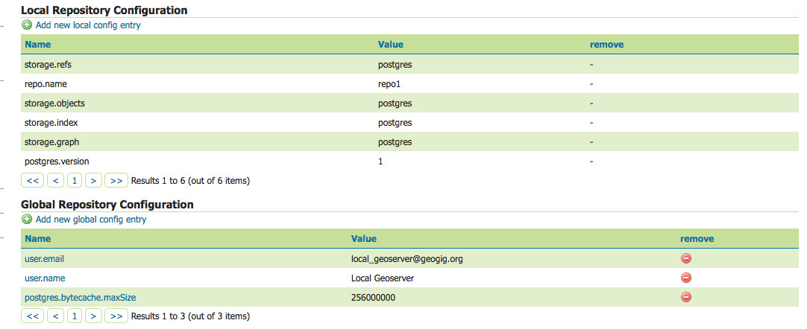

Settings with a clickable name link can be changed through this interface.  Settings indicated by a non-clickable name cannot be changed through this interface to preserve the stability of the repository.  To add a new local or global configuration setting, click the `Add new local config entry` or `Add new global config entry` link.

Each of these will present a dialog to enter the new configuration entry.

.. figure:: ../img/geogig-config-edit.png

Enter the key and value for the entry and press `Save`.

See the :ref:`Postgres Performance Tuning <postgres-performance-tuning>` section of the manual for some examples of configuration keys for PostgreSQL-backed repositories.

Press `Save` again on the repository configuration page to save the changes to the repository.

::

    Note: Some configuration settings will not take effect until the repository is re-opened.  In this case, you may need to restart GeoServer.

Cloning, Pushing, and Pulling
=============================

Once GeoServer is configured with a GeoGig repository, you can address it over the network at a URL path of the form::

    http://<host>:<port>/geoserver/geogig/repos/<geogig name>

A sample url as configured in the screenshots above::

    http://localhost:8080/geoserver/geogig/repos/geogig_dir_repo

It is then possible to clone this repository::

    $ geogig clone http://localhost:8080/geoserver/geogig/repos/geogig_dir_repo geogig_dir_repo

Your clone will be configured with the GeoServer repository as a remote. This configuration is stored in .geogig/config in your clone::

    [remote\origin]
    url = http://localhost:9090/geoserver/geogig/repos/geogig_dir_repo
    fetch = +refs/heads/*:refs/remotes/origin/*

    [branches\master]
    remote = origin
    merge = refs/heads/master

It is now possible to push and pull from this remote repository. You can verify this works by testing with the freshly cloned repository.

::

    $ geogig push origin
    Nothing to push.

    $ geogig pull origin
    100%
    Already up to date.

.. _geosever-settings:

GeoGig Runtime Settings
=======================

Some runtime aspects of GeoGig when running as part of GeoServer can be configured through the `GeoGig Settings` page as shown in the image bellow.

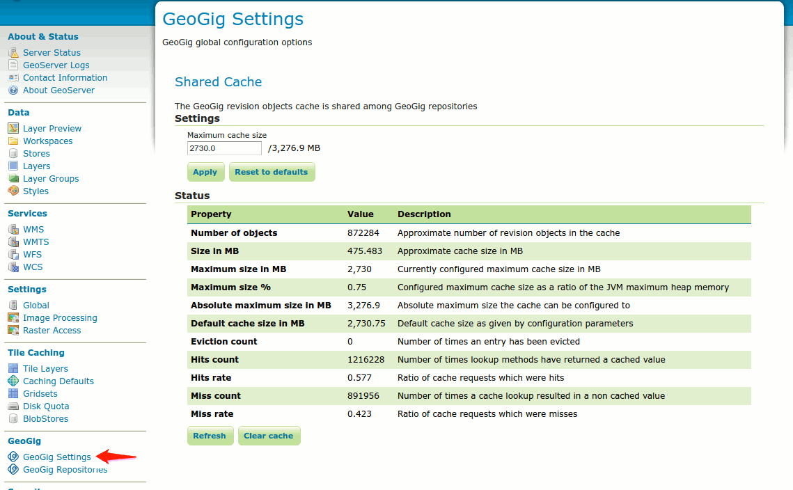

On the `Shared Cache` section of the `GeoGig Settings` configuration page, you can configure and monitor the status of GeoGig's shared revision objects cache.
For more information on what the cache is and how it works, refer to the :ref:`caching` section.

Use the ``Maximum cache size`` text entry to set a new value for the cache size in megabytes, and press the `Apply` button to make it effective.

Use the ``Reset to defaults`` button to re-establish the maximum cache size to its default value, as given by the ``GEOGIG_CACHE_MAX_SIZE`` environment variable or system property, if provided, or the internal default of 25% of the maximum heap size othwerwise.

Note these two operations are applied immediately and are destructive in the sense that the current cache will be discarded and a new one will be created, with the effect that the cache statistics shown in the table bellow them will be lost and reset.

Use the ``Refresh`` button bellow the cache attributes and statistics table to obtain fresh, real time information about the status of the cache.

Use the ``Clear cache`` button to prune all the objects currently in the cache, making the memory used immediately available to the Java Garbage Collector. This operation is non destructive, meaning the cache statistics will remain valid and further cache queries and inserts made by GeoGig will affect them.

.. _current-limitations:

Current limitations
===================

When using Directory-backed GeoGig repositories, the default underlying object database (Rocksdb) is single-user. While the repository is being exposed over the network by either the stand-alone server or by GeoServer, you will not be able to access the repository from the command line interface.

**GeoGig repositories backed by PostgreSQL do not have this limitation.**
