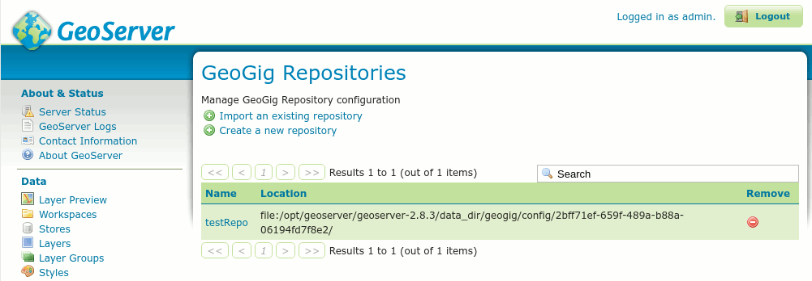

.. _geoserver_web-api-init:

Creating a GeoGig Repository using the GeoServer Web API
========================================================

As shown :ref:`previously <geoserver_web-api>`, you can use the GeoServer REST API to create a DataStore backed by a
GeoGig repository. However, the GeoGig repository must already exist. The next sections will show you how you can use the
REST API exposed by the GeoServer plugin for GeoGig in order to create a GeoGig Repository and corresponding GeoServer
DataStore in a single REST call.

.. _geoserver_web-api-plugin-init:

Plugin REST API for Creating GeoGig Repositories
------------------------------------------------

In order to create a GeoGig Repository via the plugin's REST API, you must send a **PUT** request to GeoServer that
follows this URL form::

    PUT http://<geoserver>/geogig/repos/<repository name>/init

Requests to the above URL will produce XML formatted responses. If you prefer to receive JSON formatted responses, you
can send the same request to the above URL with ``.json`` appended like this::

    PUT http://<geoserver>/geogig/repos/<repository name>/init.json

In both cases, ``<geoserver>`` should be replaced with the hostname and port where GeoServer is running (e.g.
``localhost:8080``) and ``<repository name>`` should be replaced with the desired name.

Issuing a PUT request to either of the above formatted URLs will either yeild a ``201 Created`` response (if the
GeoGig Repository was created successfully) or a ``409 Conflict`` if the **repository name** specified is already in use
as a GeoGig Repository name. For example, if you submit a PUT request to the following::

    PUT http://localhost:8080/geoserver/geogig/repos/testRepo/init

You should receive a ``201 Created`` response with a message body like this::

    <?xml version='1.0' encoding='UTF-8'?>
    <response>
        <success>true</success>
        <repo>
            <name>testRepo</name>
            <atom:link xmlns:atom="http://www.w3.org/2005/Atom" rel="alternate" href="http://localhost:8080/geoserver/geogig/repos/testRepo.xml" type="application/xml"/>
        </repo>
    </response>

If ``testRepo`` already existed, you would receive a ``409 Conflict`` response with a message body like this::

    <?xml version='1.0' encoding='UTF-8'?>
    <response>
        <success>false</success>
        <error>Cannot run init on an already initialized repository.</error>
    </response>

If you submit a PUT request and want a JSON response, the above example changes to this::

    PUT http://localhost:8080/geoserver/geogig/repos/testRepo/init.json

And a success response would look like this::

    {
      "response": {
        "success": true,
        "repo": {
          "name": "testRepo",
          "href": "http://localhost:8080/geoserver/geogig/repos/testRepo.json"
        }
      }
    }

Or, if ``testRepo`` already existed::

    {
      "response": {
        "success": false,
        "error": "Cannot run init on an already initialized repository."
      }
    }

If the PUT is successful, GeoServer should now contain a new GeoGig repository named ``testRepo`` **AND** a new GeoServer
DataStore named ``testRepo`` in the default GeoServer Workspace.

    *Newly created GeServer DataStore*

    *Newly created GeoGig Repository*

If you notice in the figure above, creating a repository this way will create the repository in a sub directory of the
GeoGig ``config`` directory of GeoServer (in this case, ``/opt/geoserver/geoserver-2.8.3/data_dir/geogig/config/``). While
this is fine, it may not be desirable to have the repository in the GeoGig config directory. Additionally, you can not
create a GeoGig repository that is backed by PostgreSQL by only providing the repository name in the PUT. See
:ref:`geoserver_web-api-plugin-init-parentDirectory` in order to create a Directory backed GeoGig Repository in a specific
Parent Directory, or :ref:`geoserver_web-api-plugin-init-postgres` to create a PostgreSQL backed GeoGig Repository.

.. _geoserver_web-api-plugin-init-parentDirectory:

Creating a GeoGig Repository in a Specific Parent Directory
-----------------------------------------------------------

If you wish to create a GeoGig Repository in a location other than GeoServer's config directory for GeoGig, you must sned
the ``parentDirectory`` parameter in the PUT request, telling the plugin in which directory to create the repository. You
can provide this parameter in one of two ways.

\1. Specify the ``parentDirectory`` as a URL encoded Form parameter, e.g.::

    curl -X PUT -H "Content-Type: application/x-www-form-urlencoded" -d 'parentDirectory=/opt/geogig/repos' "http://localhost:8080/geoserver/geogig/repos/testRepo/init"

\2. Specify the ``parentDirectory`` as a JSON object, e.g.::

    curl -X PUT -H "Content-Type: application/json" -d '{
            "parentDirectory": "/opt/geogig/repos"
        }' "http://localhost:8080/geoserver/geogig/repos/testRepo/init"

With either form, you MUST ensure that the PUT request has the correct ``Content-Type`` encoded into the request Header. If
you don't put the correct Content-Type in the Header, the plugin will not correctly parse the request and may end up
creating the repository in the GeoGig config directory, instead of where you intended.

Also, as stated in the previous section, you can request a JSON formatted response by appending ``.json`` to the URL.

.. _geoserver_web-api-plugin-init-postgres:

Creating a GeoGig Repository Backed by PostgreSQL
-------------------------------------------------

If you wish to create a GeoGig Repository that is backed by a PostgreSQL database, you must send the PostgreSQL connection
parameters in a similar way as above. Again, you may send the parameters as a URL encoded Form, or as a JSON Object.

.. _geoserver_web-api-plugin-pg-feilds-table:

**PostgreSQL connection parameters (\* indicates a required field)**

+-----------------+---------------+----------------------------+
| Parameter       | Default       | Description                |
+=================+===============+============================+
| ``dbName``      |               | Name of the PostgreSQL     |
| (\*)            |               | database to connect to     |
+-----------------+---------------+----------------------------+
| ``dbPassword``  |               | Password of the database   |
| (\*)            |               | user with which to connect |
+-----------------+---------------+----------------------------+
| ``dbHost``      | "localhost"   | Hostname of the PostgreSQL |
|                 |               | database server to connect |
|                 |               | to                         |
+-----------------+---------------+----------------------------+
| ``dbPort``      | "5432"        | Port the database is       |
|                 |               | listening on               |
+-----------------+---------------+----------------------------+
| ``dbSchema``    | "public"      | Database schema to connect |
|                 |               | to                         |
+-----------------+---------------+----------------------------+
| ``dbUser``      | "postgres"    | Username to connect with   |
+-----------------+---------------+----------------------------+

From the table above, you'll see that you must provide at least **dbName** and **dbPassword**. Defaults will be used for
the remaining parameters if not specified. Parameters can be specified as a URL encoded form or as a JSON object.

\1. URL Encoded form::

    curl -X PUT -H "Content-Type: application/x-www-form-urlencoded" -d 'dbHost=localhost&dbPort=5432&dbName=repos&dbSchema=public&dbUser=geogig&dbPassword=geogig' "http://localhost:8080/geoserver/geogig/repos/testRepo/init"

\2. JSON Object::

    curl -X PUT -H "Content-Type: application/json" -d '{
            "dbHost": "localhost",
            "dbPort": "5432",
            "dbName": "repos",
            "dbSchema": "public",
            "dbUser": "geogig",
            "dbPassword": "geogig"
        }' "http://localhost:8080/geoserver/geogig/repos/testRepo/init"

Again, the ``Content-Type`` must be set correctly for the plugin to parse the connection parameters.
