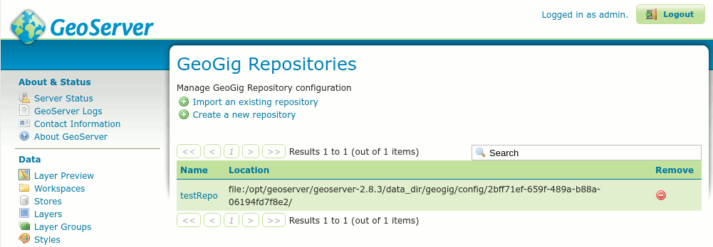

.. _geoserver_web-api:

GeoServer REST configuration integration
########################################

GeoGig integrates well with the standard GeoServer REST configuration API in order to configure vector datastores and layers from GeoGig repositories.

You can use a combination of GeoGig's own web API and GeoServer's REST configuration API to create a wide variety of scripts.

GeoServer plugin for GeoGig
===========================

With the GeoServer plug-in for GeoGig, like with the ``geogig serve --multirepo`` command, it is possible to expose several repositories. To do so, the plug-in installs web API entry points under the ``<geoserver context>/geogig/repos`` context (e.g. ``http://localhost:8080/geoserver/geogig/repos``).

That root context can be used to query which repositories are being served by GeoServer.

GeoSever managed repositories are internally identified by a UUID automatically assigned when the repository is first added to the GeoServer configuration, and published through their names. The repository name is assigned by the user and must also be unique across all the configured repositories.

Each specific repository's web API is accessed through the ``<geosever context>/geogig/repos/<repository name>`` entry point, a path change from when using the ``geogig serve`` command that exposes the repository at the ``/repos`` application context.

So, for example, whenever you would list the current HEAD's commits by querying ``http://localhost:8182/repos/<repo name>/log`` if serving a single repository with ``geogig serve``, the same command, as served by GeoServer, would be at ``http://localhost:8080/geoserver/geogig/repos/<repo name>/log``.

From that point on, the commands available are exactly the same then when using the standalone web API.

.. _geoserver_web-api-plugin-init:

Plugin web API for creating GeoGig repositories
================================================

In order to create a GeoGig Repository via the plugin's web API, you must send a **PUT** request to GeoServer that follows this URL form:

::

    PUT http://<geoserver>/geogig/repos/<repository name>/init

Requests to the above URL will produce XML-formatted responses. If you prefer to receive JSON-formatted responses, you can send the same request to the above URL with ``.json`` appended like this:

::

    PUT http://<geoserver>/geogig/repos/<repository name>/init.json

In both cases, ``<geoserver>`` should be replaced with the hostname and port where GeoServer is running (e.g.
``localhost:8080``) and ``<repository name>`` should be replaced with the desired name.

Issuing a PUT request to either of the above-formatted URLs will either yield a ``201 Created`` response, if the GeoGig Repository was created successfully, or a ``409 Conflict``, if the **repository name** specified is already in use as a GeoGig Repository name. For example, if you submit a PUT request to the following

::

    PUT http://localhost:8080/geoserver/geogig/repos/myrepo/init

You should receive a ``201 Created`` response with a message body like this:

::

    <?xml version='1.0' encoding='UTF-8'?>
    <response>
        <success>true</success>
        <repo>
            <name>myrepo</name>
            <atom:link xmlns:atom="http://www.w3.org/2005/Atom" rel="alternate" href="http://localhost:8080/geoserver/geogig/repos/myrepo.xml" type="application/xml"/>
        </repo>
    </response>

If ``myrepo`` already existed, you would receive a ``409 Conflict`` response with a message body like this::

    <?xml version='1.0' encoding='UTF-8'?>
    <response>
        <success>false</success>
        <error>Cannot run init on an already initialized repository.</error>
    </response>

If you submit a PUT request and want a JSON response, the above example changes to this::

    PUT http://localhost:8080/geoserver/geogig/repos/myrepo/init.json

And a success response would look like this::

    {
      "response": {
        "success": true,
        "repo": {
          "name": "myrepo",
          "href": "http://localhost:8080/geoserver/geogig/repos/myrepo.json"
        }
      }
    }

Or, if ``myrepo`` already existed::

    {
      "response": {
        "success": false,
        "error": "Cannot run init on an already initialized repository."
      }
    }

If the PUT is successful, GeoServer should now contain a new GeoGig repository named ``myrepo``

    *Newly created GeoGig repository*

If you notice in the figure above, creating a repository in this manner will create the repository in a sub-directory of the GeoGig ``config`` directory of GeoServer (in this case, ``/opt/geoserver/2.9/data_dir/geogig/config/``). While this is fine, it may not be desirable to have the repository in the GeoGig config directory. Also, if you do not provide additional request parameters, the repository will not have **config** parameters set for ``user.name`` or ``user.email``, which are required to be set (globally or locally) before you will be able to commit changes to the repository. Lastly, you cannot create a GeoGig repository that is backed by PostgreSQL by only providing the repository name in the PUT. See :ref:`geoserver_web-api-plugin-init-parentDirectory` in order to create a Directory-backed GeoGig repository in a specific parent directory or :ref:`geoserver_web-api-plugin-init-postgres` to create a PostgreSQL-backed GeoGig Repository.

.. _geoserver_web-api-plugin-init-parentDirectory:

Creating a GeoGig repository in a specific parent directory
===========================================================

If you wish to create a GeoGig repository in a location other than GeoServer's config directory for GeoGig, you must send the ``parentDirectory`` parameter in the PUT request, telling the plugin in which directory to create the repository. You can provide this parameter in one of two ways.

\1. Specify the ``parentDirectory``, ``authorName`` and ``authorEmail`` as a URL-encoded form parameter, e.g.::

    curl -X PUT -H "Content-Type: application/x-www-form-urlencoded" -d 'parentDirectory=/opt/geogig/repos&authorName=geogig&authorEmail=geogig@geogig.org' "http://localhost:8080/geoserver/geogig/repos/myrepo/init"

\2. Specify the ``parentDirectory``, ``authorName`` and ``authorEmail`` as a JSON object, e.g.::

    curl -X PUT -H "Content-Type: application/json" -d '{
            "parentDirectory": "/opt/geogig/repos",
            "authorName": "geogig",
            "authorEmail": "geogig@geogig.org"
        }' "http://localhost:8080/geoserver/geogig/repos/myrepo/init"

With either form, you *must* ensure that the PUT request has the correct ``Content-Type`` encoded into the request header. If you don't put the correct Content-Type in the header, the plugin will not correctly parse the request.

Also, as stated in the previous section, you can request a JSON-formatted response by appending ``.json`` to the PUT URL.

.. _geoserver_web-api-plugin-init-postgres:

Creating a GeoGig repository backed by PostgreSQL
=================================================

If you wish to create a GeoGig repository that is backed by a PostgreSQL database, you must send the PostgreSQL connection parameters in a similar manner, as above. Again, you may send the parameters as a URL-encoded form, or as a JSON Object.

.. _geoserver_web-api-plugin-pg-fields-table:

**PostgreSQL connection parameters (\* indicates a required field)**

+-----------------+---------------+----------------------------+
| Parameter       | Default       | Description                |
+=================+===============+============================+
| ``dbName``      |               | Name of the PostgreSQL     |
| (\*)            |               | database to connect to     |
+-----------------+---------------+----------------------------+
| ``dbPassword``  |               | Password of the database   |
| (\*)            |               | user with which to connect |
+-----------------+---------------+----------------------------+
| ``dbHost``      | "localhost"   | Hostname of the PostgreSQL |
|                 |               | database server to connect |
|                 |               | to                         |
+-----------------+---------------+----------------------------+
| ``dbPort``      | "5432"        | Port the database is       |
|                 |               | listening on               |
+-----------------+---------------+----------------------------+
| ``dbSchema``    | "public"      | Database schema to connect |
|                 |               | to                         |
+-----------------+---------------+----------------------------+
| ``dbUser``      | "postgres"    | Username to connect with   |
+-----------------+---------------+----------------------------+
| ``authorName``  |               | Committer name for the     |
|                 |               | repository                 |
+-----------------+---------------+----------------------------+
| ``authorEmail`` |               | Committer email for the    |
|                 |               | repository                 |
+-----------------+---------------+----------------------------+

From the table above, you'll see that you must provide at least **dbName** and **dbPassword**. Though not required, there are no default values for **authorName** or **authorEmail**. It is highly recommended that you specify these in an INIT request. Defaults will be used for the remaining parameters, if not specified. Parameters can be specified as a URL-encoded form or as a JSON object.

\1. URL-encoded form::

    curl -X PUT -H "Content-Type: application/x-www-form-urlencoded" -d 'dbHost=localhost&dbPort=5432&dbName=repos&dbSchema=public&dbUser=geogig&dbPassword=geogig&authorName=geogig&authorEmail=geogig@geogig.org' "http://localhost:8080/geoserver/geogig/repos/myrepo/init"

\2. JSON Object::

    curl -X PUT -H "Content-Type: application/json" -d '{
            "dbHost": "localhost",
            "dbPort": "5432",
            "dbName": "repos",
            "dbSchema": "public",
            "dbUser": "geogig",
            "dbPassword": "geogig",
            "authorName": "geogig",
            "authorEmail": "geogig@geogig.org"
        }' "http://localhost:8080/geoserver/geogig/repos/myrepo/init"

Again, the ``Content-Type`` must be set correctly for the plugin to parse the connection parameters and you may request a JSON-formatted response by appending ``.json`` to the PUT URL.

Creating a GeoGig datastore with REST
=====================================

To create a GeoGig datastore through the GeoServer REST API, you must already have a GeoGig repository configured in GeoServer. See :ref:`geoserver_web-api-plugin-init` for creating a GeoGig Repository in GeoServer.

Once you have a GeoGig repository, you need only follow the `standard procedure <http://docs.geoserver.org/stable/en/user/rest/api/datastores.html>`_, knowing which datastore connection parameters to use.

That is, issuing a ``POST`` request to ``/workspaces/<ws>/datastores[.<format>]``, where the request body for the XML representation appears::

   <dataStore>
      <name>${datastore name}</name>
      <connectionParameters>
         <entry key="geogig_repository">${repository URI}</entry>
         <entry key="branch">${branch}</entry>
         <entry key="autoIndexing">${autoIndexing}</entry>
      </connectionParameters>
   </dataStore>

That's all the information needed to create a GeoGig datastore.

* **${datastore name}** is the name to be given to the datastore, which then will be accessible through ``/workspaces/<ws>/datastores/<datastore name>``.
* **${repository URI}** is a GeoServer URI string that identifies the GeoGig repository in GeoServer. It should be in the form ``geoserver://<repository name>``
* **${branch}** is optional. It represents the name of the branch the datastore is going to serve its data from. If not provided, the datastore will use whichever is the currently checked out branch in the repository each time it (or the datastore) is accessed.
* **${autoIndexing}** is optional. It is a boolean value (``true`` or ``false``) that controls whether or not GeoGig repository indexes should be created/updated in this repository when layers are added/edited. The default value, if not specified, is ``false``.

.. note::
   Enabling ``autoIndexing`` is highly recommended for increasing GeoGig repository performance. See :ref:`automatic-indexing-geoserver-ui` for more.

Quick example
-------------

For the impatient, here's a very quick cheat sheet on how to create a datastore and layer for a repository.

Suppose you have a repository named ``myrepo`` in GeoServer, it contains a ``roads`` feature type tree, and GeoServer has a workspace named ``ws1``::

   curl -v -u admin:geoserver -XPOST -H "Content-type: application/xml" -d "<dataStore><name>my_geogig_repo</name><connectionParameters><entry key=\"geogig_repository\">geoserver://myrepo</entry></connectionParameters></dataStore>" http://localhost:8080/geoserver/rest/workspaces/ws1/datastores
   < HTTP/1.1 201 Created
   $ curl -v -u admin:geoserver -XPOST -H "Content-type: application/xml" -d "<featureType><name>roads</name></featureType>" http://localhost:8080/geoserver/rest/workspaces/ws1/datastores/my_geogig_repo/featuretypes
   < HTTP/1.1 201 Created

For a more thorough example take a look at the tutorial below.

cURL tutorial
=============

The following is a short tutorial on how to use a combination of GeoGig's web API and GeoServer's REST API to configure datastores and layers from a GeoGig repository.

Lets start by listing the available repositories, given there are none yet added to GeoServer:

::

   $ curl -v -u admin:geoserver -H "Accept: application/xml" "http://localhost:8080/geoserver/geogig/repos"
   < HTTP/1.1 200 OK
   < Content-Type: application/xml
   <?xml version='1.0' encoding='UTF-8'?>
   <repos/>

We got an empty list of repositories.

Create an Empty Repository
--------------------------

Now lets create an empty repository in GeoServer. Follow one of the procedures for :ref:`directory backed repositories <geoserver_web-api-plugin-init-parentDirectory>` or :ref:`PostgreSQL backed repositories <geoserver_web-api-plugin-init-postgres>`.

Create a GeoServer Workspace
----------------------------

Now lets create a workspace in GeoServer to hold our datastore::

   $ curl -v -u admin:geoserver -XPOST -H "Content-type: application/xml" -d "<workspace><name>geogigtest</name></workspace>" http://localhost:8080/geoserver/rest/workspaces
   > POST /geoserver/rest/workspaces HTTP/1.1
   < HTTP/1.1 201 Created

.. note::
   Beware of not calling your namespace ``geogig`` as it's "local workspace catalog" entry point will conflict with the ``/geogig`` web API entry point.

Create a GeoGig Datastore
-------------------------

Create a GeoGig datastore called ``geogig_datastore_test`` inside that workspace. To do so, create a file named ``datastore.xml`` in the current directory with the following content (note the value of the ``geogig_repository`` connection parameter is the repository directory)::

   <dataStore>
      <name>geogig_datastore_test</name>
      <connectionParameters>
         <entry key="geogig_repository">geoserver://myrepo</entry>
         <entry key="autoIndexing">true</entry>
      </connectionParameters>
   </dataStore>

The run::

   $ curl -v -u admin:geoserver -XPOST -H "Content-type: application/xml" -T datastore.xml http://localhost:8080/geoserver/rest/workspaces/geogigtest/datastores
   < HTTP/1.1 201 Created

And verify the datastore exists::

   $ curl -v -u admin:geoserver -XGET -H "Accept: application/xml" http://localhost:8080/geoserver/rest/workspaces/geogigtest/datastores/geogig_datastore_test
   < HTTP/1.1 200 OK
   < Content-Type: application/xml
   <dataStore>
     <name>geogig_datastore_test</name>
     <type>GeoGIG</type>
     <enabled>true</enabled>
     <workspace>
       <name>geogigtest</name>
       <atom:link xmlns:atom="http://www.w3.org/2005/Atom" rel="alternate" href="http://localhost:8080/geoserver/rest/workspaces/geogigtest.xml" type="application/xml"/>
     </workspace>
     <connectionParameters>
       <entry key="geogig_repository">geoserver://myrepo</entry>
       <entry key="namespace">http://geogigtest</entry>
       <entry key="autoIndexing">true</entry>
     </connectionParameters>
     <__default>false</__default>
     <featureTypes>
       <atom:link xmlns:atom="http://www.w3.org/2005/Atom" rel="alternate" href="http://localhost:8080/geoserver/rest/workspaces/geogigtest/datastores/geogig_datastore_test/featuretypes.xml" type="application/xml"/>
     </featureTypes>
   </dataStore>

Import Shapefile into Datastore
-------------------------------

Now, let's import some data. For this example, we are importing a ZIP of a Shapefile called ``railways.zip`` that is located in the current working directory::

   $ curl -v -u admin:geoserver -XPUT -H "Content-type: application/zip" --data-binary @railways.zip http://localhost:8080/geoserver/rest/workspaces/geogigtest/datastores/geogig_datastore_test/file.shp

Create a new Branch and Datastore
---------------------------------

You can create a second datastore for the same repository using the repository and different branch. First, let's create a new branch called ``experimental`` in the repository::

   $ curl -v -u admin:geoserver -XGET http://localhost:8080/geoserver/geogig/repos/myrepo/branch?branchName=experimental

Now, let's create a new datastore that uses this branch. To do so, copy the following XML fragment to a file called ``datastore_branch.xml``. This fragment has a different name, an extra ``branch`` connection parameter, and the same repository URI::

   <dataStore>
   <name>experimental</name>
   <connectionParameters>
      <entry key="geogig_repository">geoserver://myrepo</entry>
      <entry key="branch">experimental</entry>
      <entry key="autoIndexing">true</entry>
   </connectionParameters>
   </dataStore>

Then call the GeoServer REST API to create the new datastore::

   $ curl -v -u admin:geoserver -XPOST -H "Content-type: application/xml" -T datastore_branch.xml http://localhost:8080/geoserver/rest/workspaces/geogigtest/datastores
   < HTTP/1.1 201 Created

Finally get the new repository information::

   $ curl -u admin:geoserver -XGET -H "Accept: application/xml" http://localhost:8080/geoserver/rest/workspaces/geogigtest/datastores/experimental
   <dataStore>
     <name>experimental</name>
     <type>GeoGIG</type>
     <enabled>true</enabled>
     <workspace>
       <name>geogigtest</name>
       <atom:link xmlns:atom="http://www.w3.org/2005/Atom" rel="alternate" href="http://localhost:8080/geoserver/rest/workspaces/geogigtest.xml" type="application/xml"/>
     </workspace>
     <connectionParameters>
       <entry key="geogig_repository">geoserver://myrepo</entry>
       <entry key="namespace">http://geogigtest</entry>
       <entry key="branch">experimental</entry>
       <entry key="autoIndexing">true</entry>
     </connectionParameters>
     <__default>false</__default>
     <featureTypes>
       <atom:link xmlns:atom="http://www.w3.org/2005/Atom" rel="alternate" href="http://localhost:8080/geoserver/rest/workspaces/geogigtest/datastores/experimental/featuretypes.xml" type="application/xml"/>
     </featureTypes>
   </dataStore>

Now you have two different datastores, served from the same GeoGig repository, at different branches. These two different branches may have different feature type trees (i.e. "layers") or different versions of the same.

Verify Layers and Branches
--------------------------

Let's revisit the initial query in this tutorial and check the list of available repositories using GeoGig's own web API::

   $ curl -v -u admin:geoserver -H "Accept: application/xml" "http://localhost:8080/geoserver/geogig/repos"
   < HTTP/1.1 200 OK
   <?xml version="1.0" encoding="UTF-8"?>
   <repos>
     <repo>
       <id>bc1b0904-d43b-4871-aaad-450f1a577d15</id>
       <name>myrepo</name>
       <atom:link xmlns:atom="http://www.w3.org/2005/Atom" rel="alternate" href="http://localhost:8080/geoserver/geogig/repos/myrepo.xml" type="application/xml"/>
     </repo>
   </repos>
   $ curl -v -u admin:geoserver -H "Accept: application/xml" "http://localhost:8080/geoserver/geogig/repos/myrepo.xml"
   < HTTP/1.1 200 OK
   <?xml version='1.0' encoding='UTF-8'?>
   <repository>
      <id>bc1b0904-d43b-4871-aaad-450f1a577d15</id>
      <name>myrepo</name>
      <location>file:/opt/geogig/repos/3d54eb66-805f-4fd1-b60a-c3831b5f3765/</location>
   </repository>

Also make sure the repository contains the expected feature type trees using the ``ls-tree`` command::

   $ curl -v -u admin:geoserver -H "Accept: application/xml" "http://localhost:8080/geoserver/geogig/repos/myrepo/ls-tree"
   < HTTP/1.1 200 OK
   <response>
      <success>true</success>
      <node><path>railways</path></node>
   </response>

Finally, let's query the layer for the ``railways`` feature type (it was created when we imported the shapefile ZIP above)::

   $ curl -u admin:geoserver -XGET -H "Accept: application/xml" http://localhost:8080/geoserver/rest/layers
   <layers>
     ....
     <layer>
       <name>railways</name>
       <atom:link xmlns:atom="http://www.w3.org/2005/Atom" rel="alternate" href="http://localhost:8080/geoserver/rest/layers/railways.xml" type="application/xml"/>
     </layer>
   </layers>

Changing the configuration of either the feature types or the layers is just a matter of utilizing the usual GeoServer REST API to do so. See `Feature types <http://docs.geoserver.org/stable/en/user/rest/api/featuretypes.html>`_ and `Layers <http://docs.geoserver.org/stable/en/user/rest/api/layers.html>`_ in the GeoServer user manual for more information. The GeoServer `cURL examples <http://docs.geoserver.org/stable/en/user/rest/examples/curl.html>`_ are also a good source of information.
