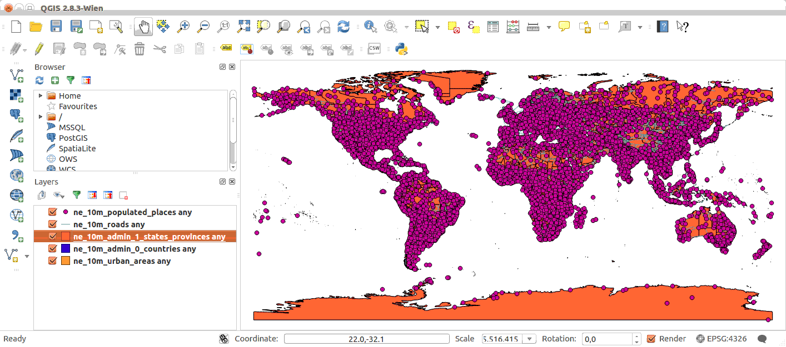

Web API: GeoPackage Import and Export
=====================================

`GeoPackage <http://www.geopackage.org/>`_ is an open, standards-based, platform-independent, portable, self-describing, compact format for transferring geospatial information.

The GeoPackage import/export GeoGig web API allows for downloading a repository snapshot, or a subset of it, as a GeoPackage file and for uploading a GeoPackage file and importing its vector layers into the GeoGig repository.

GeoPackage export
-----------------

Exports a repository snapshot or a subset of it as a GeoPackage file.

A repository snapshot is the data (layers and their features) addressable from a certain commit.

::

   GET /repos/<repo>/export[.xml|.json]?format=gpkg[&root=<refspec>][&path=<layerName>[,<layerName>]+][&bbox=<boundingBox>][&interchange=<true|false>]

Parameters
^^^^^^^^^^

**format:**
Mandatory. Must be ``gpkg`` (case-insensitive). Defines the output format of the export operation.

**root:**
Optional. Defaults to ``HEAD``. The ref spec that resolves to the root tree from where to export data (e.g. ``HEAD``, ``WORK_HEAD``, a branch name like ``master``, ``refs/heads/master``, a commit ID, possibly abbreviated like ``50e295dd``, a relative ref spec like ``HEAD~2``, ``master^4``, etc)

**path:**
Optional. A comma-separated list of layer names to export. Defaults to exporting all layers in the resolved root tree.

**bbox:**
Optional. A bounding box filter. If present, only features matching the indicated bounding box filter will be exported. Applies to all exported layers. Format is ``minx,miny,maxx,maxy,<SRS>``, where ``SRS`` is the EPSG code for the coordinates (e.g. ``EPSG:4326``, ``EPSG:26986``, etc), always using "longitude first" axis order.

**interchange:**
Optional. Boolean indicating whether to enable GeoGig's interchange format extension for GeoPackage. The "GeoGig GeoPackage Extension" is an extension to the GeoPackage format that (transparently) records all changes made to vector layers, in hidden audit tables, that can then be used to replay those changes on top of the repository.

Examples
^^^^^^^^

Missing format argument:
************************

::

	$ curl -v "http://localhost:8182/repos/repo1/export" | xmllint --format -
	< HTTP/1.1 200 OK
	< Content-Type: application/xml
	<?xml version="1.0" encoding="UTF-8"?>
	<response>
	  <success>false</success>
	  <error>output format not provided</error>
	</response>

Bad refspec:
************

Note, since the command is run asynchronously, you'll only see the error once the async task status is polled.

::

	$ curl -v "http://localhost:8182/repos/repo1/export?format=GPKG&root=nonExistingBranch" | xmllint --format -
	< HTTP/1.1 200 OK
	< Content-Type: application/xml
	<?xml version="1.0" encoding="UTF-8"?>
	<task>
	  <id>2</id>
	  <status>RUNNING</status>
	  <description>Export to Geopackage database</description>
	  <atom:link xmlns:atom="http://www.w3.org/2005/Atom" rel="alternate" href="http://localhost:8182/tasks/2.xml" type="application/xml"/>
	</task>

	$ curl -v "http://localhost:8182/tasks/1.xml" | xmllint --format -
	< HTTP/1.1 200 OK
	< Content-Type: application/xml
	<?xml version="1.0" encoding="UTF-8"?>
	<task>
	  <id>2</id>
	  <status>FAILED</status>
	  <description>Export to Geopackage database</description>
	  <atom:link xmlns:atom="http://www.w3.org/2005/Atom" rel="alternate" href="http://localhost:8182/tasks/2.xml" type="application/xml"/>
	  <error>
	    <message>RefSpec doesn't resolve to a tree: 'nonExistingBranch'</message>
	    <stackTrace><![CDATA[java.lang.IllegalArgumentException: RefSpec doesn't resolve to a tree: 'nonExistingBranch'
		at com.google.common.base.Preconditions.checkArgument(Preconditions.java:145)
		at org.locationtech.geogig.geotools.plumbing.DataStoreExportOp.resolveExportLayerRefSpecs(DataStoreExportOp.java:178)
	]]></stackTrace>
	  </error>
	</task>

Export all layers in the current HEAD:
**************************************

::

	$ curl -v "http://localhost:8182/repos/repo1/export?format=GPKG" | xmllint --format -
	< HTTP/1.1 200 OK
	< Content-Type: application/xml
	<?xml version="1.0" encoding="UTF-8"?>
	<task>
	  <id>3</id>
	  <status>RUNNING</status>
	  <description>Export to Geopackage database</description>
	  <atom:link xmlns:atom="http://www.w3.org/2005/Atom" rel="alternate" href="http://localhost:8182/tasks/3.xml" type="application/xml"/>
	</task>

Poll task status until it's FINISHED:

::

	$ curl -v "http://localhost:8182/tasks/3.xml" | xmllint --format -
	< HTTP/1.1 200 OK
	< Content-Type: application/xml
	<?xml version="1.0" encoding="UTF-8"?>
	<task>
	  <id>3</id>
	  <status>RUNNING</status>
	  <description>Export to Geopackage database</description>
	  <atom:link xmlns:atom="http://www.w3.org/2005/Atom" rel="alternate" href="http://localhost:8182/tasks/3.xml" type="application/xml"/>
	  <progress>
	    <task>Exporting from d77a84bee98ae2972953308775c0b0f318f0df6d:ne_10m_roads to ne_10m_roads... </task>
	    <amount>99.29507</amount>
	  </progress>
	</task>

	$ curl -v "http://localhost:8182/tasks/3.xml" | xmllint --format -
	< HTTP/1.1 200 OK
	< Content-Type: application/xml
	<?xml version="1.0" encoding="UTF-8"?>
	<task>
	  <id>3</id>
	  <status>FINISHED</status>
	  <description>Export to Geopackage database</description>
	  <atom:link xmlns:atom="http://www.w3.org/2005/Atom" rel="alternate" href="http://localhost:8182/tasks/3.xml" type="application/xml"/>
	  <result>
	    <atom:link xmlns:atom="http://www.w3.org/2005/Atom" rel="alternate" href="http://localhost:8182/tasks/3/download" type="application/octet-stream;type=geopackage"/>
	  </result>
	</task>

Note, once the task is finished, the `result` element contains the download link for the generated GeoPackage file.

Finally, download the GeoPackage:

::

	$ curl -v "http://localhost:8182/tasks/3/download" > all_layers_current_head.gpkg
	< HTTP/1.1 200 OK
	< Content-Type: application/octet-stream;type=geopackage
	< Content-Length: 80854016
	100 77.1M  100 77.1M    0     0   842M      0 --:--:-- --:--:-- --:--:--  847M
	* Connection #0 to host localhost left intact

That `curl` command downloaded the geopackage to the `all_layers_current_head.gpkg` file.

Now you can open it, for example, in QGIS.

::

	$ qgis all_layers_current_head.gpkg

GeoPackage import
-----------------

Imports features from a GeoPackage into the repository. The GeoPackage file should be posted to the endpoint as ``fileUpload``.

::

   POST /repos/<repo>/import[.xml|.json]?format=gpkg&transactionId=<transactionId>[&root=<refspec>][&layer=<layerName>][&interchange=<true|false>][&add=<true|false>][&alter=<true|false>][&forceFeatureType=<true|false>][&dest=<destPath>][&fidAttribute=<fidAttribute>][&authorName=<name>][&authorEmail=<email>][&message=<message>]

Parameters
^^^^^^^^^^

**fileUpload:**
Mandatory. The GeoPackage file to import from.

**format:**
Mandatory. Must be ``gpkg`` (case insensitive). Defines the input format of the import operation.

**transactionId**
Mandatory.  Import must be run on a transaction to preserve the stability of the repository.

**root:**
Optional. Defaults to ``HEAD``. The branch onto which the imported features will be imported.

**layer:**
Optional. The layer from the GeoPackage to import. If not specified, all features from the GeoPackage will be imported.  If using the interchange format, all layers must originate from the same commit.

**interchange:**
Optional. Boolean indicating whether or not the GeoPackage has the GeoGig GeoPackage Extension. If so, the changes will be imported on top of the commit they were exported from and merged into the branch specified by the ``root`` parameter or ``HEAD``.

**add:**
Optional: Boolean indicating if features should only be added (true) or replace the whole feature tree.  Not used with interchange import.

**alter:**
Optional: Boolean indicating if destination tables should be altered to match the feature type of the imported features or not.  Not used with interchange import.

**forceFeatureType:**
Optional: Boolean indicating if the imported feature type should be used even if it does not match the default feature type of the destination.  Not used with interchange import.

**dest:**
Optional: String indicating the destination path name if it should be different than the path of the features being imported.  Not used with interchange import.

**fidAttribute:**
Optional: String indicating the feature attribute to use when generating Feature Ids if the default Id creation should be overridden.  Not used with interchange import.

**authorName:**
Optional: String indicating the author name to use for the resulting commit.  The name will also be used for the merge commit if one is needed during an ``interchange`` import.

**authorEmail:**
Optional: String indicating the author email to use for the resulting commit.  The email will also be used for the merge commit if one is needed during an ``interchange`` import.

**message:**
Optional: String indicating the commit message to use for the resulting commit.

Examples
^^^^^^^^

Import without interchange format:
**********************************

::

	$ curl -X POST --form "fileUpload=@database.gpkg" "http://localhost:8182/repos/repo1/import?format=gpkg&message=Import%20GeoPackage&layer=ptLayer&transactionId=b6f3edb5-c831-4bfb-9e82-e7c0f1f8ed96" | xmllint --format -
	< HTTP/1.1 200 OK
	< Content-Type: application/xml
	<?xml version="1.0" encoding="UTF-8"?>
	<task>
	  <id>1</id>
	  <status>RUNNING</status>
	  <description>Importing GeoPackage database file.</description>
	  <atom:link xmlns:atom="http://www.w3.org/2005/Atom" rel="alternate" href="http://localhost:8182/tasks/1.xml" type="application/xml"/>
	</task>

	$ curl -v "http://localhost:8182/tasks/1.xml" | xmllint --format -
	< HTTP/1.1 200 OK
	< Content-Type: application/xml
	<?xml version="1.0" encoding="UTF-8"?>
	<task>
	  <id>2</id>
	  <status>FINISHED</status>
	  <transactionId>b6f3edb5-c831-4bfb-9e82-e7c0f1f8ed96</transactionId>
	  <description>Importing GeoPackage database file.</description>
	  <atom:link xmlns:atom="http://www.w3.org/2005/Atom" rel="alternate" href="http://localhost:8182/tasks/1.xml" type="application/xml"/>
	  <result>
	    <commit>
	      <id>f7653f2a6199f735fbeda293f9cc0ff37108f731</id>
	      <tree>5221dd3c6ec7e02c866c9ca5a909d0b2a1712c3a</tree>
	      <parents>
	        <id>4edd6c30ac54519b8eb9df27acda31ff7c98a15f</id>
	      </parents>
	      <author>
	        <name/>
	        <email/>
	        <timestamp>1462318476065</timestamp>
	        <timeZoneOffset>-14400000</timeZoneOffset>
	      </author>
	      <committer>
	        <name>Johnathan Garrett</name>
	        <email>jd@prominentedge.com</email>
	        <timestamp>1462318476065</timestamp>
	        <timeZoneOffset>-14400000</timeZoneOffset>
	      </committer>
	      <message>
	        <![CDATA[ Import GeoPackage ]]>
	      </message>
	    </commit>
	  </result>
	</task>

Import with interchange format:
*******************************

Using the interchange format allows proper handling of features that were modified in the repository since the export happened. This is done by creating a new commit with all of the modified features and then merging that commit into the current ``HEAD`` or specified branch.

::

	$ curl -X POST --form "fileUpload=@database.gpkg" "http://localhost:8182/repos/repo1/import?format=gpkg&interchange=true&message=Import%20GeoPackage&layer=ptLayer&transactionId=fd72b710-2f1c-481b-9c0c-34ac6567e96d" | xmllint --format -
	< HTTP/1.1 200 OK
	< Content-Type: application/xml
	<?xml version="1.0" encoding="UTF-8"?>
	<task>
	  <id>1</id>
	  <status>RUNNING</status>
	  <description>Importing GeoPackage database file.</description>
	  <atom:link xmlns:atom="http://www.w3.org/2005/Atom" rel="alternate" href="http://localhost:8182/tasks/1.xml" type="application/xml"/>
	</task>

	$ curl -v "http://localhost:8182/tasks/1.xml" | xmllint --format -
	< HTTP/1.1 200 OK
	< Content-Type: application/xml
	<?xml version="1.0" encoding="UTF-8"?>
	<task>
	  <id>1</id>
	  <status>FINISHED</status>
	  <transactionId>fd72b710-2f1c-481b-9c0c-34ac6567e96d</transactionId>
	  <description>Importing GeoPackage database file.</description>
	  <atom:link xmlns:atom="http://www.w3.org/2005/Atom" rel="alternate" href="http://localhost:8182/tasks/1.xml" type="application/xml"/>
	  <result>
	    <commit>
	      <id>c552789ee64b6a308420e02d24bf48b3f5647761</id>
	      <tree>7d06b74d37ce7a82804af7be2d56680cfe256bc5</tree>
	      <parents>
	        <id>4edd6c30ac54519b8eb9df27acda31ff7c98a15f</id>
	        <id>e2389ae3e85f83cf3239390648fa3698f2b1b949</id>
	      </parents>
	      <author>
	        <name>Johnathan Garrett</name>
	        <email>jd@prominentedge.com</email>
	        <timestamp>1462320893272</timestamp>
	        <timeZoneOffset>-14400000</timeZoneOffset>
	      </author>
	      <committer>
	        <name>Johnathan Garrett</name>
	        <email>jd@prominentedge.com</email>
	        <timestamp>1462320893272</timestamp>
	        <timeZoneOffset>-14400000</timeZoneOffset>
	      </committer>
	      <message>
	        <![CDATA[ Merge: Import GeoPackage ]]>
	      </message>
	    </commit>
	  </result>
	</task>

Import with interchange format with conflicts:
**********************************************

When importing with the interchange format, it is possible that the same feature was modified in both the GeoPackage and in the main repository in the time since the export was performed.  In this case, merge conflicts will occur during the import. They must be resolved before ending the transaction.

::

	$ curl -X POST --form "fileUpload=@database.gpkg" "http://localhost:8182/repos/repo1/import?format=gpkg&interchange=true&message=Import%20GeoPackage&layer=ptLayer&transactionId=aa58fce6-df67-4f87-90f3-d8d684bef52a" | xmllint --format -
	< HTTP/1.1 200 OK
	< Content-Type: application/xml
	<?xml version="1.0" encoding="UTF-8"?>
	<task>
	  <id>1</id>
	  <status>RUNNING</status>
	  <description>Importing GeoPackage database file.</description>
	  <atom:link xmlns:atom="http://www.w3.org/2005/Atom" rel="alternate" href="http://localhost:8182/tasks/1.xml" type="application/xml"/>
	</task>

	$ curl -v "http://localhost:8182/tasks/1.xml" | xmllint --format -
	< HTTP/1.1 200 OK
	< Content-Type: application/xml
	<?xml version="1.0" encoding="UTF-8"?>
	<task>
	  <id>3</id>
	  <status>FAILED</status>
	  <transactionId>aa58fce6-df67-4f87-90f3-d8d684bef52a</transactionId>
	  <description>Importing GeoPackage database file.</description>
	  <atom:link xmlns:atom="http://www.w3.org/2005/Atom" rel="alternate" href="http://localhost:8182/tasks/1.xml" type="application/xml"/>
	  <result>
	    <Merge>
	      <ours>4edd6c30ac54519b8eb9df27acda31ff7c98a15f</ours>
	      <theirs>caeccb7018dbe189c7794efab7ad5081ccff1292</theirs>
	      <ancestor>27ae08a815da0fcd1a854174aef452163c9a90f0</ancestor>
	      <conflicts>1</conflicts>
	      <Feature>
	        <change>MODIFIED</change>
	        <id>ptLayer/1</id>
	        <geometry>POINT (-0.5668599255813954 -0.3289057739534884)</geometry>
	        <crs>EPSG:4326</crs>
	      </Feature>
	      <Feature>
	        <change>CONFLICT</change>
	        <id>ptLayer/3</id>
	        <ourvalue>a185f35bc5f1484a518fbecb8515c3216d37399b</ourvalue>
	        <theirvalue>d65364e87bfd3bb5b6ce1493393152b73084a339</theirvalue>
	        <geometry>POINT (-0.4604323232323232 -0.3628242424242424)</geometry>
	        <crs>EPSG:4326</crs>
	      </Feature>
	    </Merge>
	  </result>
	</task>

.. note:: If you specify a root branch to import features onto, conflicts will leave the transaction on that branch.
