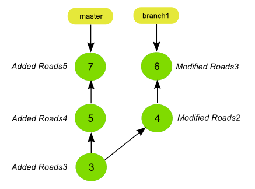
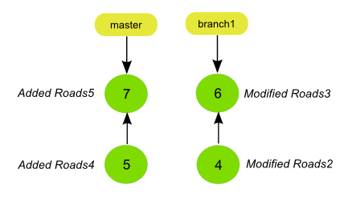
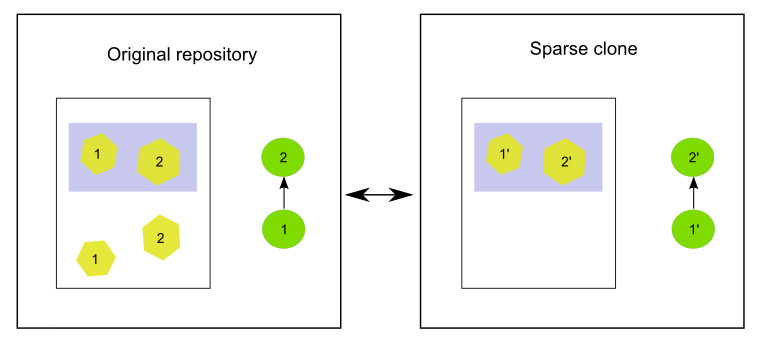
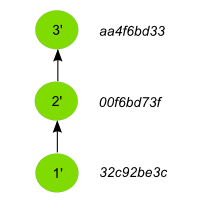
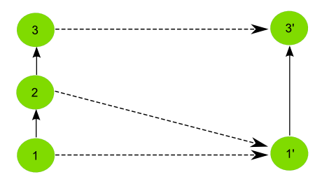

.. _repo.partialcloning:

Partial cloning
===============

While GeoGig can handle large amounts of data efficiently, a full repository might take a large space in your hard drive and cause simple operations to take a longer time. In this situation, it is a better idea to work with a reduced or "partial" clone of the original repository, so the size of that cloned repository is smaller and thus more efficient.

Such a repository can mostly be used just like any other repository clone. New data can be added, new changes can be pulled from other repositories, and also additional changes can be pushed to the original repository. However, some limitations exist, which makes it important to understand how partial cloning works, in order to work correctly on it and avoid troublesome situations.

This section deals with partial cloning, explaining how the cloning mechanism operates and discussing particular cases in which a partial repository behaves differently than a regular complete one.

Types of partial clones
-----------------------

There are two ways of partially cloning a repository:

The first type of partial clone is the **shallow clone**. A shallow clone contains *all of the features* currently stored in the most recent revision, but only a subset of the *history* of the repository. If you are not interested in having all the history of the repository features and trees, then a shallow clone will reduce the size of the cloned repository, but will have full detail in those snapshots that are within the selected history range.

The second type of partial clone is the **sparse clone**. A sparse clone of a repository contains *a subset of the features*  contained in the full repository, as defined by a filter, most often a spatial filter.

Shallow cloning
---------------

A shallow clone is a repository created by limiting the depth of the history that is cloned from an original repository. The depth of the cloned repository, which is selected when the cloning operation is performed, is defined as the number of total commits that the linear history of the repository will contain.

A shallow clone is created using the ``--depth`` option when calling the ``clone`` command, followed by the number of commits that you want to retrieve from the remote repository.

Below you can see the history of a repository with some commits and branches.

.. figure:: ../img/shallow_origin.png

The following command will create a shallow clone with a depth of 3 commits.

.. code-block:: console

   geogig clone path/to/repo --depth 3

If cloning the repository with the history graph shown above, the history of the cloned repository will be like the one shown in the next figure.

The depth of the cloning is taken into account when fetching the commits and corresponding data for each branch. Starting from the tip of the branch, all commits at a distance of less than the specified depth are fetched.

If your repository has branches other than ``master``, that can cause some special situations in the cloned repository. For instance, if branches are longer that the specified depth, they will become orphaned branches in the cloned repo, since the depth is not enough to reach the point in the history where the branch was created.

Here you can see an example of this case, obtained by cloning the original repository, but this time with a depth of 2 commits instead of 3.

.. code-block:: console

   geogig clone path/to/repo --depth 2

The ``branch1`` and ``master`` branches are disconnected from each other now, since the history doesn't go back to the point where they diverged. Operations such as ``merge`` and ``rebase`` cannot be performed in this cloned repository for the ``branch1`` branch, since there is no common ancestor between ``master`` and ``branch1``.

.. note:: Technically, a shallow clone is itself orphaned, since there is a part that is missing and there is no connection between the origin of the repository and the oldest commit in the shallow clone.

For shorter branches, the specified depth might cause the cloning operation to go into the parent branch and fetch some commits that, for that parent branch, are deeper than the specified depth.

Consider the following situation:

.. figure:: ../img/shallow_deeper_with_branches.png

A shallow clone of depth 3 of a repository with the above history would actually create a full regular clone of the repo. To get a depth of 3 for the ``branch1`` branch, the clone has to go as deep as the very first commit.

If you run the ``log`` command on the master branch of that repository, you will get something like this.

::

	$geogig log --oneline master
	72134b41bd1d21be8d5e0feb3f9e2bf2f803f2fa Added Roads5
	bb0c0b6e18f88e1871cacf98489d9df10418a22d Added Roads4
	720b29a382486b573b6529acbb8d80bb7c6ab378 Added Roads3
	86a90f34f9809f3e06a2398c97f9b6556be7f489 Added Roads2
	58dc80ae8c2656e4affba30ccbb89d526743c3d8 Added Roads1

Although the depth of the clone is just 3, you can, however, see more that 3 commits. That is because the two last commits are not actually part of the shallow clone of the ``master`` branch, but part of the cloned ``branch1`` branch.

Working with a shallow clone
~~~~~~~~~~~~~~~~~~~~~~~~~~~~

On a shallow clone, operations such as ``pull`` and ``push`` can be performed as usual, since they all work on the tip of the branches (the most recent commits). A shallow clone always contains those commits, and ignores the older ones beyond the specified depth, so it should have no problems when pushing and pulling to the full remote repository from which it has been cloned, or to any other clone, whether regular or shallow.

.. note:: A *git* shallow clone is more limited than a GeoGig shallow clone, since operations such as fetch or push cannot be performed on a *git* shallow clone.

Operations that work not on the tip of the history, but at its bottom (the older commits), also behave similar to the case of a regular repository. The situation, however, is different in that, in the case of a shallow clone, bottom commits do not have their parents stored in the repository database, since those parents are beyond the depth specified when creating the shallow clone. GeoGig handles this situation by simulating that the first commit of the shallow clone is the very first commit, having no parent.

You can see this by running the log command with the ``--changed`` option. When run, for instance, on the shallow clone of depth 3 introduced in the first example, you would get something like this.

::

	$log --changed

	XXXXX

The differences reported by the command for the first commit of the shallow clone are not the actual changes introduced by that commit, but the differences between the snapshot represented by that commit and the empty repository before any commit was made.

If you run the ``log`` command using a path, to see which commits have affected that path, the bottom-most commit will appear as responsible of having added it in the first time, in case the corresponding feature was introduced by a commit older than the specified depth limit.

::

	$log --online Roads1
	a76c6550cd45d84df09088f6efdd6747c3755643 Added Roads3

Looking at the corresponding history figure above you can see that the specified path was, however, not affected by that commit in the original repo. The very first commit, with the *Added Roads1* message, was the one that added the specified path. Since that commit is beyond the reach of the shallow clone it is included as part of the changes introduced by the first commit of that shallow clone, assuming that, for that repository, there was nothing stored before that commit.

Note that GeoGig cannot modify the commit messages to actually reflect the situation in this part of the repository history and the messages do not actually reflect the changes that are reported by the ``log`` command.

Extending the depth of a shallow clone
~~~~~~~~~~~~~~~~~~~~~~~~~~~~~~~~~~~~~~~

If, any time you want to turn your shallow clone into a regular clone that contains all the history from the original repository, you can do it by calling the ``fetch`` command with the ``--full-depth`` switch.

::

	$geogig fetch origin --full-depth

This will get not only the new commits that might exist in the remote repository, but also the full history.

To extend the shallow clone up to a certain number of commits, but not to its full history, a given depth can be specified using the ``--depth`` parameter.

For example, if the shallow clone has a depth of 2, the following call will turn it into a repository with a depth of 3.

::

	$ geogig fetch --depth 3

Sparse cloning
---------------

From the user's point of view, a sparse clone looks similar to a shallow clone: they both create a clone of a repository which contains a subset of its data, however, their mechanisms are different. This is due to the fact that a GeoGig repository is basically created as a set of commits, so any partial clone will also have a set of commits. The difference is that in the case of the shallow clone, the actual commits that constitute the original repository can be *reused*, while in the case of a sparse clone new commits have to be created to replace those original ones. This is because a commit can add or modify both features that pass the filter and features that don't pass it, so it cannot be fully added to the partial clone or completely discarded. Instead, a *partial commit* is generated and committed in the cloned repo, which replaces the original commit.

This can be seen more clearly with an example.

The number in each feature indicates the commit in which that feature was added.

The history of the original repository just has two commits. Both of them add two new features and in each case, only one of those features falls within a given region, which is the one used to define a filter and create a shallow clone.

In the cloned repository, each commit is replaced by a new one that just adds the feature that falls in the filtered area.

The number of commits doesn't have to be identical in both the original and the sparse clone. Usually, the case will not be as simple as in the example above, and some commits might not affect any of the features in the area of interest defined by the filter. These commits will not be added to the cloned repository.

Let's suppose a different history in the original repository, this time with three commits. The first one adds two features, with only one of them being within the filter bounding box. The second one adds a new feature outside that bounding box, and finally the third one modifies all of the features.

The picture below depicts the original and sparse clone for this case.

.. figure:: ../img/sparse_clone_2.png

Numbers indicate the commits that affect each feature.

In the cloned repo, the first commit (1) is replaced by a new one (1') that just adds one of the features. The second commit (2) is not applied at all, since none of the changes it introduces affect the cloned repository, so it is skipped. The third one (3) is replaced by a new commit (3') that just modifies the only feature in the cloned repository. In this case, the original commit could not be applied, and it also has to be modified. The original commit (3) changed both features that were in the database after commit 2, but in the sparse clone, only one of those features is found, since the other one was not added, as it falls outside the are of interest. Since commit 3 modifies a feature that does not exist in the sparse clone, it cannot be applied, and it is replaced by 3', which just contains the changes that affect the feature that is available.

If your cloned repository was to be used just by itself and never had any interaction with the original repository from where it originates or with other cloned repositories (whether partial or complete), then a partial clone could be created, only creating new commits that resulted in a partial repository. However, since interaction is important, a partial clone has to keep track of commits in the original repository, because otherwise, it wouldn't be able to interact with it.

The explanations that follow assume that you understand the structure of a GeoGig repository and you are familiar with the concepts introduced in the :ref:`start.introduction` section, since they are basically an extension of those ideas. Please review the corresponding chapter in case you need to refresh those concepts.

Let's see why additional information is needed to keep the link between the original and the partially cloned repository. We will go back to the first example with just two commits. Here you can see the two histories, with the corresponding abbreviated IDs of their commits.

.. figure:: ../img/sparse_clone_ids.png

The original repository had two commits, and so does the cloned one. However, if you have a look at the Id's of the commits, you will notice that they are different.

If you remember, every element in a GeoGig repository has an Id to identify it. This Id is unique, and it's based on the characteristics of the element. If a commit has a different commit time or a different set of changes, then its Id will also be different.  Since commits in the cloned repository have been modified, their Id's will not match those of the original repository.

Now imagine that you modify a feature in the cloned repo and add a new commit with that change. Your repository will have a history like this:

If you run the ``cat`` command to describe the commit that you have added, it will output something like this.

::

	$geogig cat HEAD
	id aa4f6bd33d45d84df09088f6efdd6747c3755643
	COMMIT
	tree    058c752144ed2b6e58b0e648af0a9dc821d88487
	parents    00f6bd73f763ebc7db440770506d70f5362a37b3
	author    volaya    volaya@boundlessgeo.com    1366618413840    7200000
	committer    volaya    volaya@boundlessgeo.com    1366618413840    7200000
	message    Modified feature

The ``parent`` property links a commit to the one (or several ones if it is a merge commit) that it derives from. This is what allows a GeoGig repository to communicate with other repositories and push and pull commits and data, knowing when is it possible to push and when a cloned repository is outdated and its changes cannot be pushed without risking losing data.

If we had done a regular cloning, the new commit would have a parent that actually exist in the original repository, and which is in fact its HEAD. GeoGig would recognize that situation when pushing changes, and it would add just that last commit, ignoring the previous ones, since they are already in the original repository. In our case, however, the parent of the new commit (``00f6bd73f``) does not exist in the original repository.

In the case of a shallow clone, as we have already seen, there are also some missing commits, but the situation is different, since they are missing in the local cloned repository, not in the original one. All the commits that are found in the shallow cloned repository are also found in the original repository, and have the same Id's in both repositories. In other words, the commits are exactly the same. In the case of a sparse clone, however, that is not true, and all commits have different Id's than the original commits upon which they have been created.

If we go down the history of the spare cloned repository, we cannot find any commit that is also found in the original repository, which makes it impossible to apply our changes, or, at least, to apply them cleanly.

The case is similar to what was explained in the :ref:`repo.history` section, when the problems caused by rewriting the history of a repository were discussed. Basically, when a sparse clone is created, it implies a full rewriting of the history of the cloned original repository.

To allow push and pull operations to be used without problems GeoGig solves this situation by keeping a mapping between the commits in the cloned repository and the ones in the original repository. This way, it can *translate* between Id's when it performs remote operations such as pull or push.

The picture below shows the mapping between the histories of the original and sparse clone repositories introduced in the first example, and the added commit in the tip of the local branch.

.. figure:: ../img/partial_clone_mapping.png

With that mapping, GeoGig knows that the second commit in your sparse clone (2') is related to a commit in the original remote repository (in this case, commit 2). Using that information, it will know how to handle the new commit that you have added, which has 2' as its parent, and which should have commit 2 as new parent when pushed to the remote repository.

Much in the same way, if new commits are added in the remote repository, a pull operation would bring just those new commits and not the ones in the previous history, although their commit Id's are different. GeoGig can recognize that the head of your local repository, although having a different Id that is not found in the remote repository, actually corresponds to a given commit in the remote, so it will fetch only the new commits added after that commit.

When a commit doesn't contain any changes that affect the cloned repository, as in the second commit of the second example above, we've seen that it is skipped and no commit is made in the local repository. That means that the original commit cannot be mapped to it's equivalent in the cloned repository, since there is no such equivalent. Instead, it's mapped to the previous commit that was actually applied on the cloned repository. The relation between original commits and commits in the sparse clone is not necesarilly a 1:1

The figure below shows the history mapping for the second example previously introduced.

GeoGig keeps not just a mapping that relates each original commit to a sparse commit, but also another one that maps each sparse commit to the original commit it comes from. This is done to avoid ambiguity in the case above, where several original commits are mapped to a single sparse comit. When pushing commits to a remote, GeoGig must know the single origin commit that each sparse commit comes from, and the *original-to-sparse* map might not be enough to resolve that single origin. By keeping an additional mapping, GeoGig can always find a single origin commit for each sparse commit in the sparse clone.

One exception to the mapping strategy described above happens when the empty commit is the last one at the tip of the branch. In that case, and to be able to synchronize new commits, it is necessary to map the last commit to an equivalent in the local repo, and not the previous non-empty sparse commit. GeoGig will create a new empty commit that does not introduce any change but acts as a placeholder and guarantees a correct synchronization.

The figure shows an example of this particular case.

.. figure:: ../img/placeholder_commit.png

Pull operations from a sparse clone are also *sparse*, that meaning that new commits that are fetched from the repository will also be filtered, and a new commit will be generated based on them. That commit will be added to the mapping, and the relation between it and its original counterpart will be handled by GeoGig in the same way it handles the commits that were fetched during the initial clone operation.

If new data is added in the remote repository, and it does not pass the filter of the sparse clone, a fetch operation will not bring that new data into the sparse clone.

A particular case happens when tracked features that were inside the filter are are modified and moved outside of it. In this case, GeoGig will continue to fetch those features and track them.

For instance, let's suppose that a new commit is introduced in our example remote repository with two commits, and that it moves one of the features that were inside the filter area to a new position outside of it.

.. figure:: ../img/sparse_moving_out.png

If we pull from our sparse clone, the new commit will be added, and that feature that is now outside will still be tracked and not deleted, even though it now falls outside the filter area.

The opposite case is also possible: a feature that was outside the filter area but has been modified and now falls within it. In this case, the feature will be tracked in the sparse clone starting from the commit that introduced the changed that put it into the filter area. Although that commit made a modification on a feature that already existed in the original remote, that same feature did not exist in the sparse clone. For this reason, the corresponding sparse commit to be applied to the sparse clone will not report a modification, but a new added feature instead.

Import operations do not consider the filter of the sparse clone, so an import operation will work as usual, even if the imported data does not pass the filter that defines the sparse clone

Creating a sparse clone
~~~~~~~~~~~~~~~~~~~~~~~~

As it was mentioned, a sparse clone is defined by a filter. In the most usual case, the filter is a spatial filter.

To create a sparse clone, the ``clone`` command is used with the ``--filter`` option followed by the path to the file that contains the filter, as in the next example

::

	$geogig clone ../geogig-repo --filter myfilter.xml

The filter file is an Ini file which contains filters to be applied to all features, or to specific feature types. Here you can see an example of the content of one of such files.

::

	[default]
	type = CQL
	filter = BBOX(way,-10002860,1438301,-9235433,1786854,'EPSG:900913')
	[roads]
	type = CQL
	filter = BBOX(way,-9532345,1223411,-9325678,1632340,'EPSG:900913')

There are two filters in this file. Both filters are CQL (Common Query Language) filters. The first one will be applied to all features, while the second one will only be applied to features with the ``roads`` feature type.

Notice that filtering is done based on attributes, in this case a geometry attribute named ``way``. In case you need more information, remember that you can run the ``show`` command passing a tree path as parameter, and you will get a description of the feature type of that tree, which includes information about its attributes.

You can find more information about the CQL syntax in the `this page <http://docs.geoserver.org/latest/en/user/tutorials/cql/cql_tutorial.html>`_ at the GeoServer website.

To know more about Ini files, check the corresponding `Wikipedia entry <http://en.wikipedia.org/wiki/INI_file>`_.

Limitations
~~~~~~~~~~~~

A sparse clone is a not a completely functional repository. Some operations are not allowed, since they are not compatible with the mapping strategy that GeoGig uses, and performing them could cause data loses. Most of these limitations are related to synchronizing with other repositories, or have been introduced to guarantee that synchronization operations are safe and no history or data is lost during them

Here is a list of the main limitations of a sparse clone:

- A sparse clone cannot synchronize with another sparse clone. The mapping that is kept by the local GeoGig repository maps local commits to remote commits, but commits in a different sparse clone will have different Id's (even if the filter used to create it is the same), so they will act as isolated clones, since there is no information they than can use to *understand* each other and synchronize their histories.

- A sparse can can only track one branch from a remote repository. The name of the branch has to specified when creating the sparse clone, using the ``branch`` switch. If not specified, the ``master`` branch from the remote repository will be fetched.

.. todo::  Currently there is no real way to fetch additional branches from the remote.  We'll have to add some kind of explicit way to do so.  Essentially when the remote is set up, it filters out all other refs, so if you try to fetch a different one, it won't do anything. [Extend this when it is ready]

Interaction between partial clones
------------------------------------

Partial clones can interact with the original repository from which the come from, pushing and pulling as it has been explained.  However, a sparse clone cannot communicate with a full clone of the full repository it came from, since there must be changes in the full cloned repository that are not found in the original one. If sparse changes are pushed to a clone of the full repository, the sparse clone will be unable to synchronize with the original full repository until if fetches those changes from its clone, because the sparse repository does not have the *full commit* that was made and cannot provide it during synchronization. If the full repository and its clone for some reason do not directly communicate with each other, it could be a long time before synchronization is possible again.

The figure below shows an example of an ecosystem of GeoGig repositories derived from an original one using regular and sparse clones, and how they can interact with each other.

Arrows define a possible synchronization operation between repositories, in which the local repository is at the starting point of the arrow and the remote repository at its end point. An arrow pointing from A to B means that push and pull operations can be made from A having B as the remote reository. If the line has arrows in both ends, it means that pushing and pulling is also possible from B, having A as the remote repository.

.. figure:: ../img/ecosystem.png

Here are some notes about which operations are possible depending on the type of repository, to help you understand the above figure. Numbers are used to identify the repositories

- In general, a sparse clone can act as a normal parent repository, and be cloned, whether fully and sparsely. It will behave with those cloned repositories like any other regular repository.
- A full clone can do anything that its original remote repository can do, since it contains exactly the same data. That means that a full regular clone can also interact with all the clones of the original repository in the same way the original repository does. Sparse and shallow clones are not exactly like the original repository, but a regular clone is, literally, a clone of it, so it can replace the original repository in any situation.
- An exception to the above is the case of a full clone of a sparse clone. Although the clone contains exactly the same data as the original sparse clone, it does not contain the mappings. That means that it cannot synchronize with a parent repository in the same way as the original sparse clone does. For instance, 6 is a regular clone of 2, but, unlike 2, cannot synchronize with 0. The only possible synchronization is between 6 and 2, which needs no mapping at all, since both repositories contain the same data.
- Regular clones can synchronize with their remote repository without limitations, and parent repositories can do the same with all their regular clones. That is true if the original repository is a regular one (for instance, 3 being a full clone of 0) or a sparse one (for instance, 6 being a full clone of 2, which is itself sparse, as it was mentioned in the previous point)
- Sparse clones can synchronize with their remote repositories. However, the remote repository cannot synchronize with a sparse clone of itself. This is because the original repository doesn't have the history mappings (they are created by the cloned repository), so it will understand a sparse clone as a different repo. No information is kept in a repository about other repositories cloned from it, so it is not aware of sparse clones and the relationship between sparse commits and original commits. All operations between a repository and a sparse clone created from it have to be run from the sparse clone, which is the only one that contains the additional information needed to correctly synchronize both original and sparse history.
- Sparse clones cannot synchronize between them, as it was explained before.
- In most cases, a sparse clone cannot interact with a regular clone of its parent remote repository. for instance, in the diagram above, 7 can not pull and push from 4. This would be possible only if no additional history had been added in 4. Repository number 4 has to be identical to repository 6 when it was cloned into 7. Otherwise, although they were both cloned from the same repository (2), they would be different and the sparse clone will not have mapping information for the new commits introduced in 4. Since this situation might work in a very limited context, and is likely to cause conflicting situations in most others, it is not recommended, and a sparse clone should be considered as not able to synchronize with regular clones or its parent repository, but just with the parent repository itself.

Shallow clones are less limited than sparse clones, and they do not involve the same complexity, since they do not rewrite the history and use the original commits instead, like a regular clone does. Basically, you can create shallow clones of both regular and sparse repositories, and they will behave like regular clones of those repositories. That means that you will have the same types of interaction that are shown in the figure above for the case of regular clones.

Combining shallow and sparse clones
------------------------------------

Although both shallow and sparse clones are created using the ``clone`` command, it is not possible to create a clone that is both shallow and sparse at the same time. That is, a command like the following one will cause GeoGig to show an error message:

::

	$geogig clone /path/to/repo --depth 3 --filter path/to/filter

You can have a sparse clone, and then create a shallow clone based on it, as it was discussed in the previous section, but a single clone that applies a filter and has only a fraction of the whole history is not possible.

The reason for this is that a shallow clone can be extended to get a deeper history, for instance using the ``--full-depth`` switch. In the case of a regular shallow clone, that means just inserting the missing commits at the beginning of the history, leaving the current ones in the shallow clone untouched, since their content and Id's are identical to those in the original repository.

In the case of a shallow clone that is also sparse, a full new history would be needed, since inserting those missing commits would mean changing all their children. this is like that because computing all the sparse commits with the extended history would yield different commit Id's, so it would not be possible to preserve the previous commits. Extending the shallow clone in this case would actually be equivalent to re-cloning it, discarding all the previous content of the repository.

To preserve the ability of a shallow clone to be extended, it is not allowed to create a shallow clone that is also sparse.
