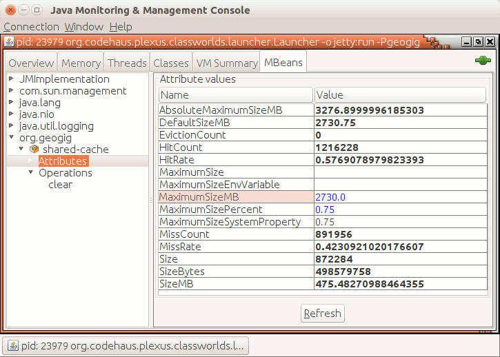

.. _runtime_config:

Runtime configuration
---------------------

Some aspects of GeoGig can be tuned or controlled through runtime arguments.

.. _caching:

Shared internal cache
=====================

GeoGig uses a local, in-memory cache for revision objects (features, commits, trees, etc) in order to alleviate the load to the backend storage and speed up some operations.

This cache is shared among all the repositories being used by a single JVM, using an LRU (Least Recently Used) eviction policy.

By default, this cache will use up to 25% of the maximum available heap memory on the Java Virtual Machine where it's running. So, for example, if your JVM is ran with the ``-Xmx4G`` argument to set a maximum heap size of 4 giga-bytes, GeoGig's cache will consume up to one giga-byte of memory.

This default cache size can be changed through the ``GEOGIG_CACHE_MAX_SIZE`` environment variable or Java system property, with the later taking precedence over the former, and can later be changed at runtime by connecting to the JVM with a JMX client or through GeoServer's User Interface as shown bellow.

The ``GEOGIG_CACHE_MAX_SIZE`` runtime argument value can be expressed in terms of a percentage of the JVM's maximum heap memory, or as an absolute value. 
through the following format:

* A value of ``0`` completely disables the cache;
* A floating point value between ``0.0`` and ``0.9``, indicates the maximum cache size as a ratio of the maximum heap size. For example, ``GEOGIG_CACHE_MAX_SIZE=0.5`` to use up to 50% of the JVM heap.
* An integer value, indicates an absolute maximum cache size in bytes. For example ``GEOGIG_CACHE_MAX_SIZE=100000`` sets the cache to one hundred thousand bytes
* A floating point value followed by a unit identifier ``K``, ``M``, or ``G``, sets the cache size to an amount in Kilobytes, Megabytes, or Gigabytes, respectively. For example, ``GEOGIG_CACHE_MAX_SIZE=1.5G`` sets the cache to ``1.5`` giga bytes.
 

In either case, the maximum cache size cannot be higher than 90% of the JVM's maximum heap size. If so, the maximum cache size will be reverted to its default, following the precedence rule: if it was given through a System property, will revert to the value of the ``GEOGIG_CACHE_MAX_SIZE`` environment variable. If the environment variable is not present or holds an invalid value, reverts to the internal default of 25% of the maximum heap size.

How to pass the ``GEOGIG_CACHE_MAX_SIZE`` argument as either an environment variable or system property depends on your running platform and the environment GeoGig is running on.

An environment variable can be set in GNU/Linux and MaxOS through the ``export GEOGIG_CACHE_MAX_SIZE=<value>`` shell command.
The Java system property is given by the ``-DGEOGIG_CACHE_MAX_SIZE=<value>`` argument to the JVM. For the command line application it can be given as part of the ``JAVA_OPTS`` environment variable, like in ``export JAVA_OPTS="-DGEOGIG_CACHE_MAX_SIZE=0.5``.

Runtime cache statistics and configuration
++++++++++++++++++++++++++++++++++++++++++

The GeoGig revision objects cache holds a number of statistics such as current cache size, memory usage, number of cache hits and misses; and it's maximum size can be changed at runtime through a JMX client such the `Java Monitoring & Management Console` or through the GeoServer's plug-in user interface.

The JMX bean is configured under the ``org.geogig:type=shared-cache`` object name. For a running JVM with geogig, you can connect to it using the standard ``jconsole`` application, connect to the JVM process of interest, select the `MBeans` tab, and browse to the shared cache as shown bellow:

On the ``org.geogig/shared-cache/attributes`` dialog, you'll see a number of cache properties, of which the ``MaximumSizeMB`` and ``MaximumSizePercent`` are editable and allows you to change the cache's maximum size value in MB or as a heap percentage, respectively.

These options are also available through GeoServer's :ref:`geosever-settings` configuration section.
