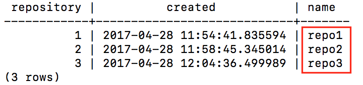

Upgrading to GeoGig 1.1
=======================

.. warning:: Ensure you have your repository database fully backed up before moving to GeoGig 1.1

.. note:: This guide centred around a PostgreSQL GeoGig backend.  If you are using a RocksDB backend, please modify the command so they point to your RocksDB.

Upgrading 1.0.0 repositories
-----------------------------

There’s been a lot of changes in GeoGig since the 1.0 release.
Our recommendation is to use GeoGig 1.1 to `clone`
your existing repository into a new repository (in a new database).
We also strongly recommend first validating a test system before attempting to upgrade a production server.
Here is a simple process to do this;

#.  Backup your existing 1.0 repository (use existing PostgreSQL tools)
#.  Create a new PostgreSQL database
#.  Use GeoGig 1.1 to `clone` the 1.0 repository into the new database
    ::

       geogig clone "postgresql://..old..repo.." "postgresql://...new repo..."

#.  Create QuadTree indexes in the new repository for the branches/layer required (see below)
#.  Setup your PG Cache sizes (see below)
#.  Upgrade your **test** server to GeoGig 1.1, pointing to the new database
#.  Test until you are satisfied that GeoGig is working in your environment and the datasets are working as expected
#.  Repeat steps 2-5 to set up a new production database
#.  Upgrade your production server to GeoGig 1.1, pointing to the new production database

Creating QuadTree Indexes
-------------------------

Creating the QuadTree Index
~~~~~~~~~~~~~~~~~~~~~~~~~~~

The following command will create a spatial index;

::

  geogig --repo "postgresql://..." index create -a <geometry column> --tree <branch>:<layer>

For help finding the names of the columns, branches, and layers see the FAQ section, below.

More help is available `here <http://geogig.org>`_ or by typing :code:`geogig index --help`.

Adding/Creating Extra Attributes
~~~~~~~~~~~~~~~~~~~~~~~~~~~~~~~~

Adding “extra attributes” to the index makes querying-by-attribute much faster.
If you have time series data (like StoryScape), you should include the dataset’s time attribute(s) to the index.
If you have SLD or other queries that do selections based on an attribute (i.e. road type), you should include those attribute(s) to the index.

::

  geogig --repo "postgresql://..." index create -a <geometry column> --tree <branch>:<layer> -e <attribute1>,<attribute2>

More help is available `here <http://geogig.org>`_ or by typing :code:`geogig index --help`.

Geoserver: Auto-Indexing (Advanced Operation)
~~~~~~~~~~~~~~~~~~~~~~~~~~~~~~~~~~~~~~~~~~~~~

The Geoserver GeoGig plugin offers the ability to automatically create indexes (and automatically add extra attributes for time series-specific attributes configured on the
*Dimension*
tab) for layers added through geoserver.
This is useful for application that dynamically create layers in Geoserver and want to have QuadTree indexes automatically created.
For more control, we recommend adding indexes explicitly through the GeoGig Rest API, however, for most applications, the auto-indexing functionality is enough (and allows existing applications to create and use the indexes without modification).

For an existing Datastore, configure the datastore and turn on the automatic indexing;

|advancedOptions_png|

For Datastores created through the REST API, set the “autoIndexing” connection parameter to “True”.

Please contact support for more details.

Configuring PostgreSQL Cache Sizes
----------------------------------

GeoGig 1.1’s caching has significantly improved since GeoGig 1.0.
However, configuring the caches is a bit more involved.
Each database (which typically has multiple repositories) needs to have a cache size set (it defaults to 10% of the JVM memory size, which is usually insufficient).

You must ensure that the sum total of all the database caches does **not** exceed the memory you have allocated for the cache or your application will run out of memory.

Also note that once you configure a cache size, **all** GeoGig applications connecting to the database will use the same sized cache, so ensure they all have enough JVM memory allocated.

Process to Set PostgreSQL Cache Sizes
~~~~~~~~~~~~~~~~~~~~~~~~~~~~~~~~~~~~~

#. Determine the amount of memory to allocate to Geoserver (this will typically be the majority of the real memory of the system) and allocate it to Geoserver with an :code:`-Xmx` java JVM option.
#. Determine the amount of memory to allocate to GeoGig and Geoserver.
   Typically, allocating approximately 2-4GB to geoserver is sufficient (depending on your use case).
#. Determine how much of the remaining memory will be allocated to each of your PG databases (do this on a database-by-database manner, NOT a repo-by-repo manner).
   Databases that are larger or more heavily used should be allocated more memory.
#. Use Geoserver to set the cache size (:code:`postgres.bytecache.maxSize`) for each of the database.

    #. In Geoserver, on the left hand column click on [GeoGig] [GeoGig Repositories]
    #. Find a repository in each of the databases and click on it.  A database can contain multiple repositories, but the cache size is set on a database-by-database manner.
    #. Press the [Add new global config] and add a config value for :code:`postgres.bytecache.maxSize` with the number of cache bytes to allocate to that database.

    |cacheConfig_png|

#. Verify that the sum total size of the caches are correct and that you have not over (or under) allocated your memory.
#. Restart Geoserver

Example
~~~~~~~~

Lets work through an example for a machine with 64GB of memory and 3 GeoGig postgresql database (DB1, DB2, DB3).
DB2 is larger and more heavily used than the other two database.

#.  We decide to allocate 62GB to Geoserver, giving 2GB of memory to other processes on the system.
    We set :code:`-Xmx62GB` and verify (see Geoserver documentation).

#.  We decide to allocate 3GB to Geoserver, leaving 59GB to GeoGig’s Cache.

#.  We decide our allocations should be 12GB (12884901888 bytes), 35GB (37580963840 bytes), and 12GB (12884901888 bytes) for the 3 databases.

#.  In geoserver, we find a repository in each database, and configure the parameter (as above).

#.  We verify;

    System Memory = <Memory allocated to OS> + <Memory exclusive to Geoserver> + <memory allocated to DB1> + <memory allocated to DB2> +<memory allocated to DB3>

    64GB = 2GB + 3GB + 12GB + 35GB + 12GB

GeoWebCache
-----------

Highly recommend seeing if you can enable this for your dataset (verify with the GWC team first).

Caveats and Issues
------------------

Bounds Problem
~~~~~~~~~~~~~~

For data created before GeoGig 1.1, the bounds of features may be slightly incorrect (usually very very very slightly incorrect).
Usually this does not affect operations because WMS request expand the bounding box while drawing.
However, certain WFS queries (like a bounding box query for a feature whose bounding box is just barely inside or outside the bounding box) may return too many or too few features.

This was corrected in GeoGig 1.1 - data created (or modified) in GeoGig 1.1 will have the correct bounds.

PostgreSQL Hash-index problem in GeoGig 1.0
~~~~~~~~~~~~~~~~~~~~~~~~~~~~~~~~~~~~~~~~~~~

Repositories created pre-GeoGig 1.0 (i.e. 1.0-pre3 and before) are using PostgreSQL hash indexes.
These are not optimal - using GeoGig 1.1 to :code:`clone` these repositories (as outlined, above) will use btree indexes instead.

HTTP-Clone
~~~~~~~~~~

There are some problems with :code:`clone` when the source/destination repositories are via HTTP (i.e. against Geoserver or the
:code:`serve` CLI). Use :code:`clone` **directly** against the underlying databases instead of the HTTP location.

Geoserver Configuration
-----------------------

Time-dimensioned data
~~~~~~~~~~~~~~~~~~~~~

Time Dimensioned datasets (in any datastore, including GeoGig) should have the internal Geoserver GetCapabilities cache disabled, or the Time dimension information in the capabilities document could be out-of-date.

::

   -DCAPABILITIES_CACHE_CONTROL_ENABLED=false

Use the Marlin Renderer
~~~~~~~~~~~~~~~~~~~~~~~

Please ensure that you are using the Marlin renderer (especially on AWS deployments) - testing has shown it has significantly better performance with GeoGig (and many other datastores).

Configure repositories to use a specific branch
~~~~~~~~~~~~~~~~~~~~~~~~~~~~~~~~~~~~~~~~~~~~~~~

GeoGig can reduce the number of roundtrips to the database if you configure the datastore to point to a particular branch (instead of “Use currently checked out branch”).
This improves performance.

|branchConfig_png|

Control-Flow Extension
~~~~~~~~~~~~~~~~~~~~~~

Consider using the control-flow extension to limit the number of simultaneous request to geoserver.

For Clustered Environment
~~~~~~~~~~~~~~~~~~~~~~~~~

GeoGig/Geoserver has not been formally testing in a clustered environment - there are a few likely issue that we hope to resolve in the very new future.

Please note that GeoGig performs better with a larger cache, so each geoserver instance in your cluster should be allocated a lot of memory.

RDS Network Performance
~~~~~~~~~~~~~~~~~~~~~~~

One of the limiting performance limitations is how quickly your PostgreSQL RDS instance can transfer data to GeoGig.

#.  Use an RDS instance with at least “HIGH” network performance (or better)
#.  Increase the size of your GeoGig memory cache
#.  Limit the number of features retrieved/drawn for a single request
#.  Use GWC to cache WMS requests

FAQs
----

How to find all the repos in a database?
~~~~~~~~~~~~~~~~~~~~~~~~~~~~~~~~~~~~~~~~

Connect to the PostgreSQL database and execute;

::

   SELECT * FROM geogig_repository_name;

|repoNameSQL_png|

How to find all the layers that I might need to build an index on?
~~~~~~~~~~~~~~~~~~~~~~~~~~~~~~~~~~~~~~~~~~~~~~~~~~~~~~~~~~~~~~~~~~

::

   geogig --repo "postgresql://..." ls <branch>

How do I find the name of the Geometry (and other columns)?
~~~~~~~~~~~~~~~~~~~~~~~~~~~~~~~~~~~~~~~~~~~~~~~~~~~~~~~~~~~

::

   geogig --repo "postgresql://..." show <branch>:<layer>

|geomName_png|

How do I find the Branches in my repository?
~~~~~~~~~~~~~~~~~~~~~~~~~~~~~~~~~~~~~~~~~~~~

::

   geogig --repo "postgresql://..." branch -a

